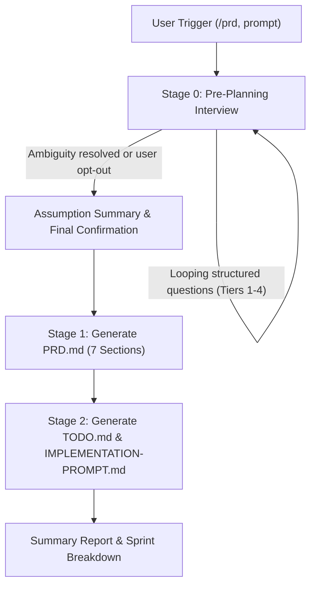

# 📋 PRD Generator Skill

> **Autonomous, battle-tested Product Requirements Document (PRD) generator with synchronized companion execution files (Sprint TODO + Full Autopilot Implementation Prompt) for AI Coding Agents.**

[](SKILL.md)
[](LICENSE)
[](#)

---

## 🌟 Overview

**PRD Generator** transforms raw product ideas and rough concepts into production-ready software specifications. Built specifically for agentic development workflows, it enforces a **mandatory Pre-Planning Interview** to eliminate ambiguity upfront, then generates **3 tightly synchronized markdown documents**.

Whether building web apps, mobile apps, SaaS platforms, or internal tools, this skill gives your coding agents an unambiguous blueprint to execute without getting stuck in assumption loops.

---

## 📦 Synchronized Output Deliverables

Every generation run produces up to 3 synchronized markdown files in your project directory:

| File | Purpose | Scope & Features |
| :--- | :--- | :--- |
| **`[Project-Name]-PRD.md`** | **Complete 7-Section PRD** | Complete specification with problem context, user requirements, core MVP features, step-by-step user flows, Mermaid Architecture (`graph TD`), Mermaid Database Schema (`erDiagram`), and strict Design & Technical Constraints. |
| **`[Project-Name]-TODO.md`** | **2-Phase Task Checklist** | 15–30 granular, actionable tasks divided into **Phase 1: Frontend Prototype (Mock Data)** and **Phase 2: Backend Integration**, separated by a mandatory user approval gate. |
| **`[Project-Name]-IMPLEMENTATION-PROMPT.md`** | **Full Autopilot Agent Prompt** | Standalone, self-contained prompt optimized for AI agents (Antigravity, Claude Code, Cursor). Runs autonomously across tasks with an explicit stop-and-wait gate between Phase 1 and Phase 2. |

> [!IMPORTANT]
> **Task Number Synchronization**: Task IDs in `[Project-Name]-TODO.md` strictly map 1-to-1 with the step references in `[Project-Name]-IMPLEMENTATION-PROMPT.md`.

---

## 🚦 End-to-End Workflow



### 1. 🚦 Stage 0: Pre-Planning Interview (Mandatory)
Before generating any specifications, the skill runs an interactive interview using structured question tools (`ask_user` / `ask_question`) to eliminate planning gaps across 4 tiers:

- **Tier 1: Product Identity & Scope** — App name, platform (web/mobile/CLI/API), target users, roles/permissions, output language.
- **Tier 2: Features & Business Logic** — MVP core scope, out-of-scope boundaries, business rules, edge cases.
- **Tier 3: Tech Stack & UI Reference** — Frameworks, database, auth method, API dependencies, design system reference.
- **Tier 4: Non-Functional Requirements** — Scale, compliance, performance, localization, notification channels.

### 2. 🎨 UI/UX Design System Presets (Embedded in PRD Section 7)
If the project has a user interface and the user has no pre-existing design reference, the interview presents 4 curated design system presets:

| Preset | Ideal For | Key Tokens & Aesthetics |
| :--- | :--- | :--- |
| **1. Modern Minimalist** | SaaS, admin dashboards, productivity tools | `Inter`/`Geist Sans`, `JetBrains Mono`, near-black `#18181B`, accent blue `#3B82F6`, `rounded-md`, clean whitespace. |
| **2. Bold & Friendly** | Consumer apps, startups, community platforms | `Plus Jakarta Sans`/`Poppins`, purple `#7C3AED`, warm orange `#F59E0B`, `rounded-xl`, vibrant card styling. |
| **3. Corporate & Formal** | Enterprise software, fintech, internal tools | `IBM Plex Sans`, navy `#1E3A5F`, slate accent `#64748B`, `rounded-sm`, dense tabular data layouts. |
| **4. Dark Tech** | Developer tools, cloud monitoring, cybersecurity | `Geist Sans`, `JetBrains Mono`, dark base `#0A0A0B`, neon cyan `#22D3EE` / lime accents, subtle glow borders. |

### 3. 🧱 Stage 1: Standard 7-Section PRD
1. **Overview** — Problem statement, target audience, and primary objectives.
2. **Requirements** — Accessibility standards, user personas, input data formats, notification flows.
3. **Core Features** — Detailed functional breakdown of MVP capabilities.
4. **User Flow** — Chronological user journey and interaction steps.
5. **Architecture** — High-level architecture with Mermaid diagram (`graph TD`).
6. **Database Schema** — Entity-Relationship model with Mermaid diagram (`erDiagram`).
7. **Design & Technical Constraints** — Framework selection, typography, color palettes, responsive layouts, and performance rules.

### 4. 🧩 Stage 2: 2-Phase Execution & Full Autopilot
- **Phase 1: Frontend-Only Prototype (Mock Data)** — Build interactive screens, components, mock data stores, and client-side flows for rapid visual validation.
- **GATE: User Approval Checkpoint** — The agent stops, presents the working prototype, and requests confirmation before proceeding.
- **Phase 2: Backend Integration & Hardening** — Real database schemas, migrations, authentication, API endpoints, error handling, and end-to-end tests.
- **Full Autopilot Execution** — The Implementation Prompt instructs coding agents to work continuously without per-task micromanagement unless pair programming mode is explicitly requested.

---

## 🚀 Triggers & Usage

Activate this skill by typing any of the following slash commands or prompts in your AI assistant:

### Slash Commands
```text
/prd
/prd-generator
/generate-prd
/buat-prd
```

### Natural Language Examples
```text
"Generate a PRD for a multi-tenant SaaS invoicing platform with Stripe billing"
"Buatkan PRD dan implementation prompt untuk aplikasi manajemen inventaris gudang"
"Create a comprehensive PRD and 2-phase TODO list for an AI recipe generator"
```

---

## 📂 Repository Structure

Built with a **progressive disclosure** architecture to preserve agent token budget:

```text
prd-generator/
├── SKILL.md                                    # Main orchestrator & routing instructions
├── README.md                                   # Complete skill documentation & guide
├── prd-generator.skill                         # Packaged bundle for distribution
└── references/
    ├── interview-guide.md                      # Stage 0: 4-tier interview guide & question taxonomy
    ├── prd-format.md                           # Stage 1: 7-section PRD markdown template & Mermaid specs
    ├── todo-template.md                        # Stage 2: 2-phase sprint checklist template (Appendix A)
    ├── implementation-prompt-template.md       # Stage 2: Full autopilot coding prompt (Appendix B)
    └── design-system-presets.md                # 4 ready-to-use UI/UX design presets for Section 7
```

---

## ⚙️ Conditional Logic & Skips

- **Non-Technical Projects**: If generating a PRD for standard operating procedures (SOP), business logic, or marketing operations, the skill skips the Implementation Prompt.
- **No-Backend / API-Only Projects**: If the project has no custom backend (e.g. consuming an existing third-party API), the 2-phase split converts into a single linear priority backlog.

---

## 🌐 Language Conventions

- **Default Language**: English for all documentation, specs, user flows, and checklists (unless Bahasa Indonesia or another language is explicitly requested during Tier 1 interview).
- **Code Identifiers**: Always English for variable names, database tables/columns, route paths, CLI commands, and code blocks.

---

## 📝 Changelog

- **v1.5**: Defaulted Implementation Prompt to **Full Autopilot** mode (agent continuously progresses without per-step interruptions; single mandatory stop gate at the end of Phase 1).
- **v1.4**: Restructured execution into **2-Phase Architecture** (Phase 1 Frontend Prototype with mock data → User Approval Gate → Phase 2 Backend Integration).
- **v1.3**: Integrated **UI/UX Design Presets** into Pre-Planning Interview & PRD Section 7 (eliminating separate UI/UX file overhead).
- **v1.2**: Consolidated deliverable output to **3 synchronized markdown files** (PRD, TODO, Implementation Prompt).
- **v1.1**: Re-architected with **Progressive Disclosure** (clean `SKILL.md` orchestrator + detailed `references/` files).
- **v1.0**: Initial monolithic release.

---

## 📄 License

MIT License. Free to use, modify, and distribute for personal and commercial AI agent workflows.
