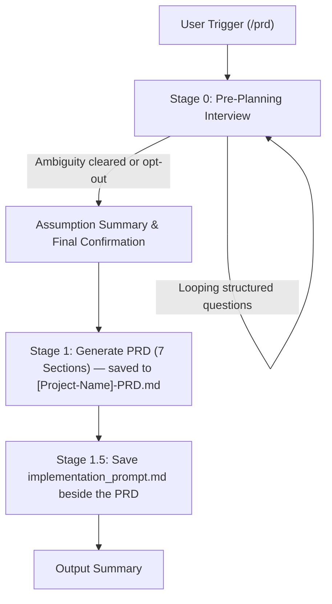

# 📋 PRD Generator Skill

> Automated, highly structured Product Requirements Document (PRD) generator plus a self-contained `implementation_prompt.md` for AI Coding Agents.

[](SKILL.md)
[](LICENSE)

---

## 🌟 Overview

**PRD Generator** is a specialized skill designed for modern AI Coding Assistants (Google Antigravity, Claude Code, Cursor, Mavis, etc.) that turns product concepts into production-ready specifications.

It enforces a **mandatory Pre-Planning Interview** to eliminate ambiguity before writing, then produces a PRD file and a copyable `implementation_prompt.md` file.

---

## 📦 Output Deliverables (2 Files)

Every execution produces:

| Output | Type | Purpose | Mandatory? |
| :--- | :--- | :--- | :--- |
| **`[Project-Name]-PRD.md`** | **File** (saved to disk) | Complete 7-section PRD (Overview, Requirements, Core Features, User Flow, Mermaid Architecture `graph TD`, Mermaid Database Schema `erDiagram`, Design & Technical Constraints) | ✅ Always |
| **`implementation_prompt.md`** | **File** (saved beside the PRD) | Self-contained execution prompt ready to paste into coding agents (Antigravity, Claude Code, Cursor). Defaults to Full Autopilot with a single approval gate after the production-grade frontend (with realistic synthetic data) is ready | ✅ Technical Projects |

> [!IMPORTANT]
> **Prompt file**: The Implementation Prompt is always saved as `implementation_prompt.md` in the same directory as the PRD. The file contains only the completed, ready-to-paste prompt.

> [!NOTE]
> **UI/UX Design Spec**: There is no separate UI/UX Prompt file. For projects with a UI, the design system is gathered during the Tier 3 interview (user's own reference, or 4 curated presets from `references/design-system-presets.md`) and embedded directly into PRD Section 7.

---

## 🚦 End-to-End Workflow



### 1. 🚦 Stage 0: Pre-Planning Interview
- Eliminates guesswork before generating documents.
- Uses structured user questioning tools (`ask_user` / `ask_question`).
- **4 Progressive Question Tiers**:
  - **Tier 1**: Product Identity & Scope (Product name, target platform, domain, roles, output language).
  - **Tier 2**: Features & Business Logic (MVP scope, out-of-scope items, custom workflows/rules).
  - **Tier 3**: Tech Stack & UI References (Frameworks, DB, auth methods, design systems, external APIs).
  - **Tier 4**: Non-Functional Requirements (Scale, compliance, multi-tenancy, i18n, notifications).
- Loops until planning is unambiguous or the user explicitly opts out (`"skip interview"`, `"just generate"`).

### 2. 🧱 Stage 1: Standard 7-Section PRD (saved as a file)
1. **Overview** — Problem context & primary objective.
2. **Requirements** — Accessibility, user personas, input data formats, notification flows.
3. **Core Features** — Detailed MVP feature scope.
4. **User Flow** — Step-by-step user journey.
5. **Architecture** — System architecture with Mermaid diagram (`graph TD`).
6. **Database Schema** — Relational schema with Mermaid diagram (`erDiagram`).
7. **Design & Technical Constraints** — Strict typography, color systems, layout, and framework rules.

### 3. 🧩 Stage 1.5: Implementation Prompt File
- A self-contained prompt saved as `implementation_prompt.md` beside the PRD.
- Enforces **Phase 1: Production-Grade Frontend with Realistic Synthetic Data** — finished-quality UI/UX, authentic domain-accurate data, full client-side state interactivity (CRUD, search, filter, pagination), and a strict ban on any "demo/prototype" badges, watermarks, or gimmicks.
- Contains tech stack, working principles, execution mode (Full Autopilot by default), and the mandatory approval gate after Phase 1 is built and committed.
- Ready to copy-paste into a coding agent to execute the PRD.

---

## 🚀 Triggers & Usage

Activate this skill by typing any of the following in your AI assistant prompt:

### Slash Commands
- `/prd`
- `/prd-generator`
- `/generate-prd`
- `/buat-prd`

### Natural Language
- *"generate a PRD for an e-commerce app..."*
- *"build a PRD and implementation prompt for..."*
- *"create a PRD for an inventory management system"*
- *"design prompt and PRD for..."*

---

## 📂 Repository Structure

The skill is built using a **progressive disclosure** architecture to optimize LLM context usage:

```
prd-generator/
├── SKILL.md                                    # Main orchestrator & routing layer
├── README.md                                   # Documentation & usage guide
├── prd-generator.skill                         # Compiled skill package for distribution
└── references/
    ├── interview-guide.md                      # Stage 0: Pre-planning interview guide & tier taxonomy
    ├── prd-format.md                           # Stage 1: 7-section PRD markdown template & Mermaid specs
    ├── implementation-prompt-template.md       # Stage 1.5: Implementation prompt file template
    └── design-system-presets.md                # Stage 0: 4 ready-to-use UI/UX design system presets
```

---

## ⚙️ Conditional Skips

- **Skip Implementation Prompt**: Only when building non-technical projects (SOP, business process, content marketing) or explicitly requested.

---

## 🌐 Language Conventions

- **Default Output**: English for descriptions, specifications, workflows, and explanations.
- **Code & Technical Names**: English for variables, database column/table names, directory paths, CLI commands, and code snippets.

---

## 📝 Changelog

- **v2.1**: Eliminated prototype/demo framing and enforced **Production-Grade Frontend with Realistic Synthetic Data**.
  - Renamed Phase 1 in the Implementation Prompt from "Frontend Prototype (Mock Data)" to "Production-Grade Frontend (Realistic Synthetic Data)".
  - Added strict zero-demo policy: banned all "Demo", "Demo Mode", "Preview", "Prototype", and "Mock Data" badges, banners, alerts, and watermarks.
  - Mandated high-fidelity, domain-authentic synthetic records (prohibiting lazy placeholders like "Lorem ipsum" or "Product 1") and full client-side state interactivity (CRUD, search, filter, pagination).
  - Added Hard Rule #11 in `SKILL.md` enforcing the zero-demo and realistic synthetic data standard.

- **v2.0**: Changed the Implementation Prompt deliverable from inline chat output to the required `implementation_prompt.md` file, saved alongside the PRD.

- **v1.8**: Restructured the Implementation Prompt for clarity and copy-paste readiness, and enforced a strict no-chatter output rule. The new prompt template uses standard markdown (no excessive emojis inside the prompt), clear bracketed placeholders, and 8 distinct sections (Context, Tech Stack, Mission, Execution Mode, Working Principles, File Architecture, First Steps, Communication, Hard Limits, Optional Variations). The chat output rule now mandates: single code block, NO intro line, NO outro text, NO summary, NO usage tips. Optionally, a one-line PRD save confirmation may appear before the code block; nothing after it. New hard rule #6 in `SKILL.md` codifies this, and new rule #12 explicitly forbids saving the prompt as a file.
- **v1.7**: Added mandatory Mermaid `erDiagram` syntax validation. New section in `references/prd-format.md` covers the exact `ENTITY1 ||--o{ ENTITY2 : "label"` format, 5 common parse errors (label-between-entities, many-to-many without bridge table, entity names with spaces, reserved keywords, ghost entities), and a 7-point self-check checklist the agent MUST run before saving the PRD. New hard rule #11 in `SKILL.md` enforces this self-check.
- **v1.6**: Simplified output — only 1 file (`[Project-Name]-PRD.md`) + 1 chat output (the Implementation Prompt as an inline code block, NOT a file). Removed the TODO List file entirely. The Implementation Prompt is now self-contained and no longer syncs task numbers with a separate TODO file. Frontend-first approval gate preserved as a principle inside the prompt.
- **v1.5**: Implementation Prompt explicitly defaults to **Full Autopilot** — auto-continues task after task without asking permission in between. Progress reports are FYI, not confirmation requests. The only mandatory pause is the GATE after the frontend prototype is ready for review. Per-task confirmation (Pair Programming) is now opt-in.
- **v1.4**: TODO List & Implementation Prompt restructured into **2 phases** (Phase 1 Frontend-Only with mock data → User approval checkpoint → Phase 2 Backend). The Implementation Prompt had an explicit GATE forcing the agent to stop & request approval at the end of Phase 1 before starting Phase 2.
- **v1.3**: UI/UX Reference brought back as an **interview sub-flow** (not a separate file). The user is asked whether they have a design reference; if not, 4 design system presets are offered. The result goes into PRD Section 7.
- **v1.2**: UI/UX Reference Prompt (Appendix C) removed entirely — the skill produced 3 files (PRD, TODO, Implementation Prompt). The `uiux-prompt-template.md` was removed from the package.
- **v1.1**: Restructured into progressive disclosure (concise SKILL.md + `references/`) to save context on trigger. Fixed 2 non-Indonesian character bugs. Max questions per call adjusted to match the user-question tool's actual schema.
- **v1.0**: Initial monolithic version, single file (~1000 lines).

---

## 📄 License

MIT License. Feel free to use, modify, and distribute for your own projects and agent setups.
