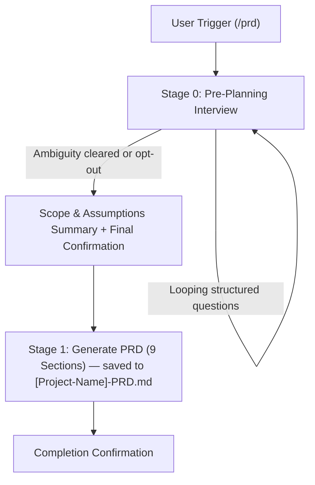

# 📋 PRD Generator Skill

> Automated, highly structured Product Requirements Document (PRD) generator following industry-standard Product Management methodology.

[](SKILL.md)
[](LICENSE)

---

## 🌟 Overview

**PRD Generator** is a specialized skill designed for modern AI Coding Assistants (Google Antigravity, Claude Code, Cursor, Mavis, etc.) that turns product concepts into production-ready specifications following industry-standard Product Management methodologies.

It enforces a **mandatory Pre-Planning Interview** to eliminate ambiguity before writing, then produces a comprehensive, standardized 9-section PRD file (`[Project-Name]-PRD.md`).

---

## 📦 Output Deliverable (1 File)

Every execution produces:

| Output | Type | Purpose | Mandatory? |
| :--- | :--- | :--- | :--- |
| **`[Project-Name]-PRD.md`** | **File** (saved to disk) | Complete 9-section PM Standard PRD (Document Control, Executive Summary & KPIs, Scope & Assumptions, User Personas & RBAC, Functional Requirements, Edge Cases, NFRs, User Flows, Technical & Architecture Specs Appendix) | ✅ Always |

> [!NOTE]
> **Single Deliverable Standard**: This skill focuses exclusively on delivering an exhaustive, professional Product Requirements Document without extraneous code-generation prompts or prototype scaffolds.
> **UI/UX Design Spec**: For projects with a UI, the design system is gathered during the Tier 3 interview (user's own reference, or 4 curated presets from `references/design-system-presets.md`) and embedded directly into PRD Section 9.4 ("Design System Tokens").

---

## 🚦 End-to-End Workflow



### 1. 🚦 Stage 0: Pre-Planning Interview
- Eliminates guesswork before generating documents.
- Uses structured user questioning tools (`ask_user` / `ask_question`).
- **4 Progressive Question Tiers**:
  - **Tier 1**: Product Identity, Problem & Scope (Product name, domain, target platform, success metrics/KPIs, roles, language).
  - **Tier 2**: Features, Boundaries & Edge Cases (MVP feature engines, out-of-scope/non-goals, custom rules, failure modes).
  - **Tier 3**: Tech Stack & UI References (Frameworks, DB, auth methods, design systems, external APIs).
  - **Tier 4**: Non-Functional Requirements (Scale, latency targets, compliance, multi-tenancy, i18n).
- Loops until planning is unambiguous or the user explicitly opts out (`"skip interview"`, `"just generate"`).

### 2. 🧱 Stage 1: Standard 9-Section Product Management PRD (saved as a file)
1. **Document Control & Metadata** — Version, status (Draft/In Review/Approved), author, reviewer, target milestone.
2. **Executive Summary & Problem Statement** — Background, core problem, vision, measurable KPIs with baseline vs. target.
3. **Scope & Assumptions** — Foundational assumptions, in-scope MVP capabilities, explicit out-of-scope (non-goals).
4. **User Personas & Permissions** — Target user personas, responsibilities, and complete RBAC matrix.
5. **Functional Requirements** — Capability engines / epics, user stories, acceptance criteria, business logic (zero styling clutter).
6. **Edge Cases & Exception Handling** — System behavior for connection drops, GPS drift, hardware failure, user recovery.
7. **Non-Functional Requirements (NFR)** — Usability, performance & latency budgets, security, data integrity, reliability.
8. **User Flows & Visual Diagrams** — End-to-end user journeys (ASCII diagrams & Mermaid flowcharts/state diagrams).
9. **Technical & Architecture Specs (Appendix / TRD Bridge)** — Architecture `graph TD`, Data Model `erDiagram`, tech stack, design system tokens.

---

## 🚀 Triggers & Usage

Activate this skill by typing any of the following in your AI assistant prompt:

### Slash Commands
- `/prd`
- `/prd-generator`
- `/generate-prd`
- `/buat-prd`

### Natural Language
- *"generate a PRD for an e-commerce app..."*
- *"create a PRD for an inventory management system"*
- *"build a PRD for..."*
- *"product requirements document for..."*

---

## 📂 Repository Structure

The skill is built using a **progressive disclosure** architecture to optimize LLM context usage:

```
prd-generator/
├── SKILL.md                                    # Main orchestrator & routing layer
├── README.md                                   # Documentation & usage guide
├── prd-generator.skill                         # Compiled skill package for distribution
└── references/
    ├── interview-guide.md                      # Stage 0: Pre-planning interview guide & tier taxonomy
    ├── prd-format.md                           # Stage 1: 9-section PM PRD markdown template & Mermaid specs
    └── design-system-presets.md                # Stage 0: 4 ready-to-use UI/UX design system presets
```

---

## 🌐 Language Conventions

- **Default Output**: English for descriptions, specifications, workflows, and explanations (or Indonesian if requested by user).
- **Code & Technical Names**: English for variables, database column/table names, directory paths, CLI commands, and code snippets.

---

## 📝 Changelog

- **v3.0**: **Pure Product Management PRD Standard (Single Deliverable)**.
  - Eliminated `implementation_prompt.md` deliverable and Stage 1.5. Output is strictly 1 file: `[Project-Name]-PRD.md`.
  - Removed all artificial coding-agent execution constraints (Phase 1/Phase 2, Approval Gate, Production-Grade Frontend, Realistic Synthetic Data mandates, and Zero-Demo rules).
  - Streamlined the skill to focus 100% on standard, comprehensive, and professional Product Requirements Documents.
- **v2.2**: Upgraded to **9-Section Product Management Standard PRD Structure**.
  - Restructured PRD into 9 standard PM sections: Document Control, Executive Summary & KPIs, Scope & Assumptions, User Personas & RBAC, Functional Requirements, Edge Cases & Exception Handling, Non-Functional Requirements, User Flows & Visual Diagrams, and Technical & Architecture Specs (Appendix / TRD Bridge).
  - Eliminated redundancy between former Section 2 (Requirements) and Section 3 (Core Features) by establishing consolidated **User Personas & Roles** (Section 4) and **Functional Requirements** (Section 5) organized by Core Engines / Epics.
  - Enforced strict separation of **WHAT/WHY vs HOW**: banned premature styling (Tailwind CSS classes, hex colors) from functional specifications, encapsulating design tokens cleanly in Section 9.4 and layout constraints in Section 7.1.
  - Added **Document Control & Metadata** (Section 1) with semver, author, status, and milestone tracking.
  - Added **Measurable Success Metrics & KPIs** (Section 2.3) with baseline vs. target benchmarks.
  - Placed **Scope & Assumptions** (Section 3) upfront with explicit **Out-of-Scope (Non-Goals)** to prevent scope creep from day one.
  - Added dedicated **Edge Cases & Exception Handling** (Section 6) covering network disruption, GPS drift, hardware failure, and user feedback recovery.
  - Relegated architecture diagrams (`graph TD`), data model (`erDiagram`), tech stack, and design tokens into **Technical & Architecture Specs** (Section 9) as a clean TRD bridge.
- **v2.1**: Eliminated prototype/demo framing and enforced Production-Grade Frontend with Realistic Synthetic Data.
- **v2.0**: Changed the Implementation Prompt deliverable from an inline chat code block to a required `implementation_prompt.md` file saved alongside the PRD.
- **v1.9**: Hardened Mermaid validation after a repeated `erDiagram` parse failure.
- **v1.8**: Restructured the Implementation Prompt for clarity and copy-paste readiness.
- **v1.7**: Added mandatory Mermaid `erDiagram` syntax validation.
- **v1.6**: Simplified output to 1 file + 1 chat output.
- **v1.5**: Implementation Prompt explicitly defaults to Full Autopilot.
- **v1.4**: 2 phases structure.
- **v1.3**: UI/UX Reference interview sub-flow.
- **v1.2**: Removed separate UI/UX prompt file.
- **v1.1**: Restructured into progressive disclosure (`SKILL.md` + `references/`).
- **v1.0**: Initial monolithic version.
