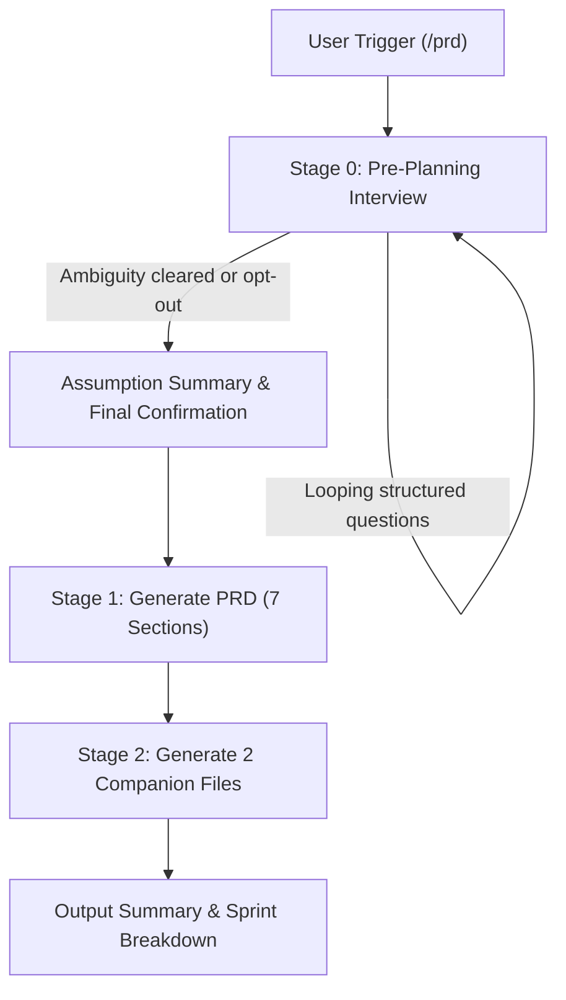

# 📋 PRD Generator Skill

> Automated, highly structured Product Requirements Document (PRD) generator with synchronized companion execution files (Sprint TODO + Implementation Prompt) for AI Coding Agents.

[](SKILL.md)
[](LICENSE)

---

## 🌟 Overview

**PRD Generator** is a specialized skill designed for modern AI Coding Assistants (Google Antigravity, Claude Code, Cursor, Mavis, etc.) that turns product concepts into production-ready specifications.

It enforces a **mandatory Pre-Planning Interview** to eliminate ambiguity before writing, followed by the generation of **3 synchronized deliverables** tailored for development teams.

---

## 📦 Output Deliverables (3 Synchronized Files)

Every execution produces up to 3 synchronized markdown files in your project directory:

| File | Purpose | Mandatory? |
| :--- | :--- | :--- |
| **`[Project-Name]-PRD.md`** | Complete 7-section PRD (Overview, Requirements, Core Features, User Flow, Mermaid Architecture `graph TD`, Mermaid Database Schema `erDiagram`, Design & Technical Constraints) | ✅ Always |
| **`[Project-Name]-TODO.md`** | 2-phase task list (Phase 1: Frontend-Only with mock data → Approval Checkpoint → Phase 2: Backend), 15–30 granular tasks | ✅ Always |
| **`[Project-Name]-IMPLEMENTATION-PROMPT.md`** | Self-contained, task-synced execution prompt ready to paste into coding agents (Antigravity, Claude Code, Cursor). Defaults to Full Autopilot with a single approval gate at the end of Phase 1 | ✅ Technical Projects |

> [!IMPORTANT]
> **Task Number Synchronization**: Task IDs in the TODO checklist (`[Project-Name]-TODO.md`) strictly match the step references in the Implementation Prompt.

> [!NOTE]
> **UI/UX Design Spec**: There is no separate UI/UX Prompt file. For projects with a UI, the design system is gathered during the Tier 3 interview (user's own reference, or 4 curated presets from `references/design-system-presets.md`) and embedded directly into PRD Section 7.

---

## 🚦 End-to-End Workflow



### 1. 🚦 Stage 0: Pre-Planning Interview
- Eliminates guesswork before generating documents.
- Uses structured user questioning tools (`ask_user` / `ask_question`).
- **4 Progressive Question Tiers**:
  - **Tier 1**: Product Identity & Scope (Product name, target platform, domain, roles, output language).
  - **Tier 2**: Features & Business Logic (MVP scope, out-of-scope items, custom workflows/rules).
  - **Tier 3**: Tech Stack & UI References (Frameworks, DB, auth methods, design systems, external APIs).
  - **Tier 4**: Non-Functional Requirements (Scale, compliance, multi-tenancy, i18n, notifications).
- Loops until planning is unambiguous or the user explicitly opts out (`"skip interview"`, `"just generate"`).

### 2. 🧱 Stage 1: Standard 7-Section PRD
1. **Overview** — Problem context & primary objective.
2. **Requirements** — Accessibility, user personas, input data formats, notification flows.
3. **Core Features** — Detailed MVP feature scope.
4. **User Flow** — Step-by-step user journey.
5. **Architecture** — System architecture with Mermaid diagram (`graph TD`).
6. **Database Schema** — Relational schema with Mermaid diagram (`erDiagram`).
7. **Design & Technical Constraints** — Strict typography, color systems, layout, and framework rules.

### 3. 🧩 Stage 2: Companion Execution Files
- `[Project-Name]-TODO.md`: 2-phase task list (Phase 1 Frontend-only mock data → Approval Checkpoint → Phase 2 Backend) with priority tags (`[HIGH]`, `[MEDIUM]`, `[LOW]`).
- `[Project-Name]-IMPLEMENTATION-PROMPT.md`: Standalone prompt for automated AI developer agents, with Full Autopilot execution mode and an explicit approval gate at the end of Phase 1.

---

## 🚀 Triggers & Usage

Activate this skill by typing any of the following in your AI assistant prompt:

### Slash Commands
- `/prd`
- `/prd-generator`
- `/generate-prd`
- `/buat-prd`

### Natural Language
- *"generate a PRD for an e-commerce app..."*
- *"build PRD and implementation prompt for..."*
- *"create a PRD for an inventory management system"*
- *"design prompt and PRD for..."*

---

## 📂 Repository Structure

The skill is built using a **progressive disclosure** architecture to optimize LLM context usage:

```
prd-generator/
├── SKILL.md                                    # Main orchestrator & routing layer
├── README.md                                   # Documentation & usage guide
├── prd-generator.skill                         # Compiled skill package for distribution
└── references/
    ├── interview-guide.md                      # Stage 0: Pre-planning interview guide & tier taxonomy
    ├── prd-format.md                           # Stage 1: 7-section PRD markdown template & Mermaid specs
    ├── todo-template.md                        # Stage 2: TODO list format (Appendix A, 2-phase)
    ├── implementation-prompt-template.md       # Stage 2: Coding agent prompt template (Appendix B, Full Autopilot)
    └── design-system-presets.md                # Stage 0: 4 ready-to-use UI/UX design system presets
```

---

## ⚙️ Conditional Skips

- **Skip Implementation Prompt**: Only when building non-technical projects (SOP, business process, content marketing) or explicitly requested.
- **Skip 2-Phase TODO Structure**: Only for projects without a UI, or where the frontend consumes an existing external API (no custom backend).

---

## 🌐 Language Conventions

- **Default Output**: English for descriptions, specifications, workflows, and explanations.
- **Code & Technical Names**: English for variables, database column/table names, directory paths, CLI commands, and code snippets.

---

## 📝 Changelog

- **v1.5**: Implementation Prompt now explicitly defaults to **Full Autopilot** — auto-continues task after task without asking permission in between. Progress reports are FYI, not confirmation requests. The only mandatory pause is the GATE at the end of Phase 1. Per-task confirmation (Pair Programming) is now opt-in.
- **v1.4**: TODO List & Implementation Prompt restructured into **2 phases** (Phase 1 Frontend-Only with mock data → User approval checkpoint → Phase 2 Backend). The Implementation Prompt now has an explicit GATE that forces the agent to stop & request approval at the end of Phase 1 before starting Phase 2.
- **v1.3**: UI/UX Reference brought back, but as an **interview sub-flow** (not a separate file). The user is asked whether they have a design reference; if not, 4 design system presets are offered. The result goes into PRD Section 7.
- **v1.2**: UI/UX Reference Prompt (Appendix C) removed entirely per request — the skill now produces only 3 files (PRD, TODO, Implementation Prompt). The `uiux-prompt-template.md` was removed from the package.
- **v1.1**: Restructured into progressive disclosure (concise SKILL.md + `references/`) to save context on trigger. Fixed 2 non-Indonesian character bugs. Max questions per call adjusted to match the user-question tool's actual schema.
- **v1.0**: Initial monolithic release (~1000 lines).

---

## 📄 License

MIT License. Feel free to use, modify, and distribute for your own projects and agent setups.
