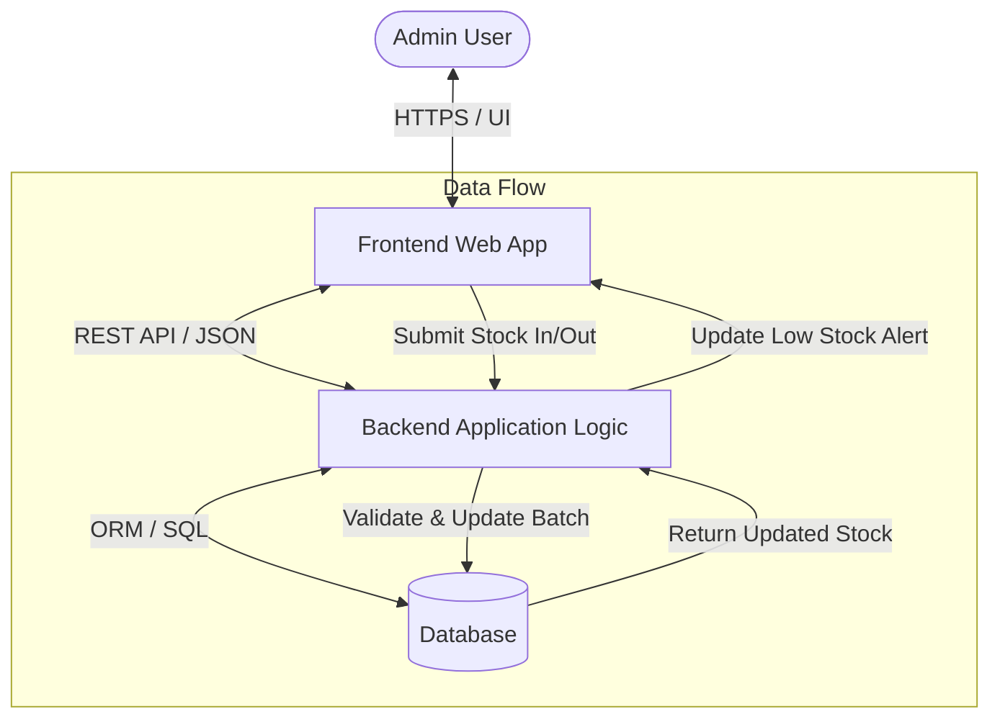
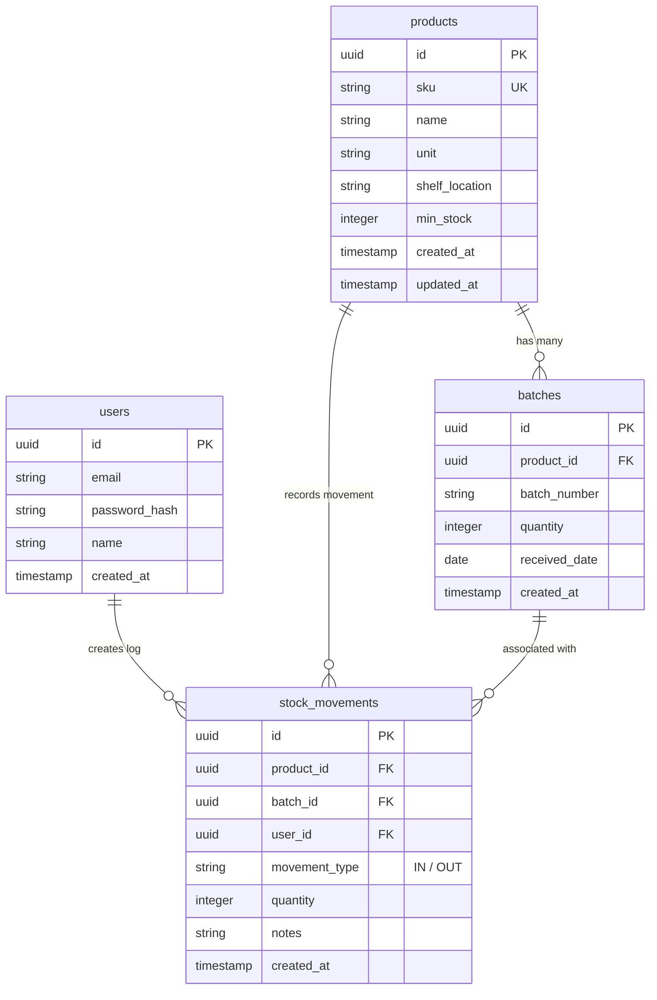

# PRD Generator Skill

Skill ini memandu AI Agent untuk membuat **Product Requirements Document (PRD)** yang sangat terstruktur, profesional, dan akurat dalam Bahasa Indonesia sesuai dengan standar 7 bagian berikut.

---

## Slash Commands & Trigger

Skill ini otomatis dipicu ketika Anda mengetik perintah slash atau kata kunci berikut:
- `/prd`
- `/prd-generator`
- `/buat-prd`
- `/generate-prd`
- Mengatakan *"buatkan PRD"*, *"buat PRD"*, *"generate PRD"*, *"PRD document"*, *"implementation prompt"*, *"prompt implementasi"*, *"UI/UX prompt"*, *"design prompt"*, *"prompt desain"*, dll.

---

## 📦 Output Deliverables (4 File Wajib)

Setiap kali skill ini dipicu, agent WAJIB menghasilkan **4 file markdown** di folder yang sama:

| File | Isi | Wajib? |
| :--- | :--- | :--- |
| `[Nama-Proyek]-PRD.md` | Product Requirements Document (7 section) | ✅ Selalu |
| `[Nama-Proyek]-TODO.md` | Task list sprint-based dengan checkbox | ✅ Selalu |
| `[Nama-Proyek]-IMPLEMENTATION-PROMPT.md` | Prompt siap-paste ke coding agent | ✅ Untuk proyek teknis |
| `[Nama-Proyek]-UIUX-PROMPT.md` | Prompt referensi UI/UX untuk design spec | ✅ Untuk proyek dengan UI |

Keempat file SINKRON — nomor task di TODO harus sama dengan referensi di Implementation Prompt dan UI/UX Prompt.

**Pengecualian**:
- **Implementation Prompt**: Lewati hanya jika proyek non-teknis (proses bisnis, SOP, content strategy) atau user minta tanpa prompt.
- **UI/UX Prompt**: Lewati hanya jika proyek **tanpa UI** (API service, CLI tool, backend-only, data pipeline) atau user minta tanpa prompt UI/UX.

---

## 🚦 Tahap 0: Pre-Planning Interview — Resolusi Ambiguitas (WAJIB SEBELUM GENERATE)

Sebelum agent mulai nulis PRD, agent WAJIB menjalani **Pre-Planning Interview** untuk ngilangin ambiguitas. **TIDAK ADA BATAS JUMLAH PERTANYAAN** — agent bertanya terus (loop) sampai **planning sudah tidak ambigu** atau user explicit opt-out.

### Kapan Interview Berhenti (Hanya 2 Kondisi)

1. **Tidak ada lagi ambiguitas kritis** yang tersisa → agent masuk ke Tahap 1 (generate file PRD).
2. **User explicit opt-out** dengan kata kunci seperti *"skip interview"*, *"cukup"*, *"langsung generate"*, *"pakai default saja"*, *"udah cukup"*, *"lanjut"* → agent dokumentasikan semua asumsi di section **"Catatan & Asumsi"** PRD, lalu masuk ke Tahap 1.

> **Hard rule**: Agent **TIDAK BOLEH** berhenti hanya karena info yang dikumpulkan "sebagian besar sudah ada". Loop terus sampai planning clear atau user stop. Bertanya terus = lebih bagus daripada PRD yang isinya banyak asumsi keliru.

### Definisi: Apa yang "Ambigu"?

Input user disebut **ambigu** (wajib diklarifikasi) jika ketiadaannya akan memaksa agent mengambil keputusan yang **materially mengubah** scope, tech stack, architecture, atau feature set PRD. Contoh ambigu:

- ❌ Tidak ada **nama produk/aplikasi**
- ❌ Tidak ada **domain industri** (retail, F&B, SaaS B2B, edukasi, kesehatan, logistik, dll)
- ❌ Tidak ada info **platform target** (web app / mobile native / mobile web / desktop / CLI / API-SDK / IoT)
- ❌ Tidak ada info **user/role/permission**
- ❌ Tidak ada list **fitur MVP** (cuma "buat aplikasi X" tanpa spek fitur)
- ❌ Tidak ada **referensi UI/UX** (Figma, mockup, brand kit, design system, contoh app)
- ❌ **Tech stack** tidak disebut padahal krusial untuk pilihan implementation
- ❌ **Workflow / business rule** belum jelas (FIFO/LIFO stok, approval multi-step, hitung ulang, dll)
- ❌ Tidak ada info **integrasi eksternal** (payment gateway, SSO, third-party API, email service, cloud storage)
- ❌ Tidak ada info **deployment target** (Vercel / self-host Docker / on-premise / specific cloud)
- ❌ **Compliance/security** tidak jelas padahal industri mengharuskan (GDPR, HIPAA, PCI-DSS)
- ❌ **Bahasa output PRD** tidak disebut (Indonesia / English)
- ❌ **Auth method** tidak jelas untuk proyek dengan login

Yang **TIDAK ambigu** (agent boleh pakai default tanpa nanya):

- ✅ Detail typography minor (font size, line-height) → pakai default Section 7
- ✅ Icon library (lucide-react default)
- ✅ Sprint timeline detail → agent estimasi sendiri berdasarkan kompleksitas
- ✅ Quick wins → agent tentukan berdasarkan best practice
- ✅ Naming convention file/folder → agent pilih yang idiomatik per framework
- ✅ State management library per framework → pakai default komunitas
- ✅ Test framework per bahasa → default (Jest/Vitest untuk JS, pytest untuk Python, dll)

### Cara Bertanya: WAJIB Pakai `ask_user`

Agent **WAJIB** pakai structured question tool `ask_user` — **BUKAN** tanya di plain text chat. Aturan main:

- **Maksimal 4 pertanyaan per call** (hard constraint tool).
- **2–4 opsi konkret per pertanyaan**, mutually exclusive, level abstraksi sama.
- **Opsi "Lainnya"** disediakan lewat UI tool — user bisa ketik jawaban custom.
- **Batch pintar**: re-batch lintas tier kalau lebih efisien (misal 2 dari Tier 2 + 2 dari Tier 3 dalam 1 call).
- **Loop sampai clear**: setelah setiap batch jawaban, evaluasi lagi. Kalau masih ada ambiguitas kritis, batch berikutnya → tanya lagi → evaluasi → dst.
- **JANGAN ulangi pertanyaan** yang sudah terjawab (cek history chat dulu).
- **JANGAN tanya detail kosmetik** yang bisa diasumsikan dari PRD Section 7.

### Tier Pertanyaan (Bertahap, Bukan Bombarding)

Agent bertanya **per tier**, mulai dari Tier 1, dan **BOLEH skip tier** kalau info sudah jelas dari request awal atau jawaban tier sebelumnya.

#### Tier 1 — Identitas & Lingkup (WAJIB, kecuali sudah jelas di request)

1. **Nama produk/aplikasi** — kalau user belum kasih.
2. **Domain industri** — retail, F&B, SaaS B2B/B2C, edukasi, kesehatan, logistik, finance, manufaktur, dll.
3. **Platform target** — web app, mobile native (iOS/Android), mobile web/PWA, desktop (Electron/Tauri), CLI, API/SDK, embedded/IoT, atau kombinasi.
4. **Target pengguna & role** — siapa primary user, role apa saja, apakah perlu RBAC multi-level.
5. **Apakah sudah ada PRD/dokumen referensi sebelumnya** — untuk konsistensi (jika ya, minta lokasi file).
6. **Bahasa output PRD** — Bahasa Indonesia atau English (default: Indonesia, sesuai bahasa user).

#### Tier 2 — Fitur & Workflow (Ditanya kalau fitur user masih vague)

1. **Fitur MVP wajib** — list fitur inti (1–3 kalimat per fitur), atau pilih preset by domain.
2. **Yang TIDAK masuk MVP** — out-of-scope eksplisit (out-of-scope = tidak dibangun di fase awal).
3. **Workflow / business rule khusus** — approval flow, FIFO/LIFO, auto-numbering, multi-step form, validasi spesifik, dll.
4. **Entitas data utama** — list entity (User, Product, Order, dll) atau preset by domain.
5. **Reporting / analytics** — laporan apa saja yang harus ada di MVP (penjualan, stok, keuangan, dll).

#### Tier 3 — Tech & Design (Ditanya kalau belum disebut & krusial)

1. **Tech stack preference** — framework, bahasa, database, ORM (atau *"pilih yang terbaik untuk use case"* → agent putuskan).
2. **UI/UX reference** — apakah ada Figma/mockup/brand kit/design system existing? (jika tidak, agent generate design system default).
3. **Color/typography preference** — warna brand, font khusus, atau *"pakai default profesional"*.
4. **Auth method** — email/password, OAuth (Google/GitHub/Apple), magic link, SSO enterprise, atau kombinasi.
5. **Integrasi eksternal** — payment gateway, email service, third-party API, cloud storage, CDN, search engine.
6. **Deployment target** — Vercel/Netlify, AWS/GCP/Azure, self-host Docker, on-premise, atau *"belum tahu"*.

#### Tier 4 — Non-Functional (Ditanya HANYA jika material terhadap scope)

1. **Performance / scale** — expected user count, data volume, peak load, response time target.
2. **Compliance / security** — GDPR, HIPAA, PCI-DSS, ISO 27001, SOC 2, atau standar lokal (UU PDP Indonesia, dll).
3. **Multi-tenancy** — apakah multi-tenant (satu aplikasi untuk banyak organisasi) atau single-org.
4. **i18n / multi-bahasa** — apakah perlu support multiple locale (i18n) atau single language cukup.
5. **Notification channels** — email, push notification, in-app, SMS, WhatsApp, webhook.
6. **File upload / media handling** — perlu upload file? format apa? ukuran max? (gambar, dokumen, video).
7. **Offline / PWA** — apakah perlu jalan tanpa internet (PWA, sync queue).
8. **Audit log** — apakah perlu track semua perubahan data untuk compliance/debug.

### Template Pesan Pembuka Interview

Saat masuk mode interview, agent WAJIB buka dengan pesan (atau setara) untuk set expectation:

```
Oke, sebelum gua generate PRD-nya, gua perlu klarifikasi beberapa hal dulu
biar hasilnya tepat sasaran dan ga ada asumsi yang meleset.

Gua bakal tanya pakai question card — jawab seadanya, atau pilih opsi
yang paling cocok. Kalau lo udah ada jawabannya, langsung ketik via
opsi "Lainnya".

Kalau lo udah males dan mau skip interview, bilang aja "skip interview"
atau "langsung generate dengan default" — gua bakal catat semua asumsi
yang gua pakai di section "Catatan & Asumsi" PRD.

Mulai dari pertanyaan pertama...
```

### Loop & Termination Logic

Setelah setiap batch `ask_user` dijawab, agent jalankan loop ini:

1. **Parse jawaban** user dari semua pertanyaan di batch.
2. **Cek ambiguitas** yang masih tersisa (referensi "Definisi: Apa yang Ambigu?" di atas).
3. **Jika masih ada ambiguitas kritis** → batch pertanyaan berikutnya (Tier selanjutnya atau pertanyaan yang ter-skip) → tanya lagi via `ask_user` → goto step 1.
4. **Jika tidak ada lagi ambiguitas kritis** → tampilkan **ringkasan asumsi terkonfirmasi** ke user, tanya konfirmasi final: *"Lanjut generate dengan info ini?"* (1 pertanyaan terakhir, binary) → masuk ke Tahap 1.
5. **Jika user bilang stop/opt-out di tengah** ("cukup", "lanjut", "udah") → agent evaluasi cepat, dokumentasikan asumsi untuk yang belum terjawab, **tetap tampilkan ringkasan + tanya konfirmasi final**, lalu masuk ke Tahap 1.

### Catatan Penting untuk Agent

- **JANGAN** tanya pakai plain text — selalu `ask_user` (kecuali pesan pembuka & ringkasan).
- **JANGAN** tanya detail kosmetik yang bisa diasumsikan (typography minor, spacing, icon library).
- **JANGAN** ulangi pertanyaan yang sudah terjawab.
- **BOLEH skip tier** kalau info di tier tersebut sudah jelas dari request awal.
- **BOLEH re-batch** pertanyaan lintas tier (misal 2 Tier 2 + 2 Tier 3 dalam 1 call) untuk efisiensi.
- **SELALU** dokumentasikan asumsi di section **"Catatan & Asumsi"** PRD kalau user opt-out dari pertanyaan tertentu.
- **Jika user bilang "yang penting jadi dulu" / "simple aja"** — interview tetap dilakukan, tapi agent kompres jadi 1–2 batch dengan pertanyaan paling kritis saja (identitas + fitur MVP + tech stack).
- **Jika user kasih info super lengkap di request awal** (misal: *"buatkan PRD untuk POS kafe multi-outlet, Next.js + Supabase, sudah ada Figma di link X, target 50 outlet dalam 6 bulan"*) — agent boleh skip interview, langsung tampilkan ringkasan asumsi + tanya konfirmasi final, lalu generate.

### Contoh Flow

**Request user**: *"buatkan PRD untuk aplikasi POS untuk kafe"*

**Agent — Pembuka**: pesan pembuka interview (template di atas).

**Agent — Batch 1** (Tier 1, 4 pertanyaan via `ask_user`):
- Q1: Bahasa output PRD? → ID / EN
- Q2: Target deployment? → Vercel / Self-host Docker / Cloud (AWS/GCP) / Belum tahu
- Q3: Auth method? → Email-password / OAuth (Google) / SSO enterprise
- Q4: Ada Figma/design system reference? → Ya (sebutkan) / Tidak (generate default)

*(user jawab batch 1)*

**Agent — Evaluasi**: POS untuk kafe sudah jelas konteksnya, payment & printer struk masih ambigu → lanjut batch 2.

**Agent — Batch 2** (Tier 3, 3 pertanyaan via `ask_user`):
- Q1: Payment method? → Tunai saja / Tunai + QRIS / Multi-payment (tunai + QRIS + debit + e-wallet)
- Q2: Integrasi printer struk? → Bluetooth thermal / Network printer / Tanpa printer
- Q3: Multi-outlet atau single outlet? → Single outlet / Multi-outlet dengan konsolidasi / Multi-outlet独立

*(user jawab batch 2)*

**Agent — Evaluasi**: Tidak ada ambiguitas kritis tersisa → tampilkan ringkasan asumsi + tanya konfirmasi final.

**Agent — Ringkasan**:
```
Asumsi terkonfirmasi:
- POS kafe, single outlet, deployment Vercel, auth email-password
- Payment: tunai + QRIS, printer struk Bluetooth, design system default
- Bahasa output: Indonesia

Lanjut generate dengan info ini? (Yes / No, mau ubah sesuatu)
```

*(user jawab Yes)*

**Agent → Tahap 1**: Generate 4 file (PRD, TODO, Implementation Prompt, UI/UX Prompt) + section "Catatan & Asumsi" di PRD yang list semua asumsi di atas.

---

## Format & Struktur PRD Wajib

Setiap PRD yang dihasilkan HARUS mengikuti struktur 7 bagian utama ini secara presisi:

```markdown
# PRD — Product Requirements Document: [Nama Produk / Aplikasi]

## 1. Overview
### Latar Belakang & Masalah Utama
[Jelaskan masalah yang ingin diselesaikan, misal: mendigitalkan pencatatan manual, melacak stok real-time, lokasi rak, nomor batch]

### Tujuan Utama Aplikasi
[Deskripsikan visi aplikasi, platform target (Web/Mobile), target pengguna (misal Admin Tunggal), serta hasil yang diharapkan]

---

## 2. Requirements
Tuliskan persyaratan tingkat tinggi (High-Level Requirements) sistem:
- **Aksesibilitas**: [Perangkat & platform akses, misal: Web Browser desktop/laptop]
- **Pengguna**: [Akses & role pengguna, misal: Admin Tunggal dengan akses penuh]
- **Data Input**: [Metode entri data, misal: Input manual diketik vs Scan barcode]
- **Spesifisitas Data**: [Rincian atribut penting per produk, misal: Nomor Batch, Lokasi Rak]
- **Notifikasi**: [Mekanisme notifikasi/alert, misal: Visual Low Stock Alert di Dashboard]

---

## 3. Core Features
Daftar fitur kunci untuk MVP (Minimum Viable Product):

### 1. Dashboard Utama
- Ringkasan total jumlah produk dan nilai aset (opsional).
- Panel Peringatan Stok (Low Stock Alert): Daftar produk di bawah batas minimum.

### 2. Manajemen Produk (Master Data)
- Tambah, Edit, dan Hapus Produk (CRUD).
- Kolom Wajib: Nama Produk, SKU, Satuan, Lokasi Rak, Minimum Stok.

### 3. Pencatatan Stok Masuk (Inbound)
- Form entri penambahan stok.
- Input wajib: Pilih Produk, Jumlah, Nomor Batch, Tanggal Masuk.

### 4. Pencatatan Stok Keluar (Outbound)
- Form pengurangan stok.
- Input wajib: Pilih Produk, Jumlah, Pilih Batch (FIFO/LIFO manual/otomatis), Keterangan.

### 5. Laporan Riwayat (Movement Logs)
- Tabel transaksi riwayat movement log.
- Atribut: Admin (Pengguna), Waktu (Timestamp), Produk, Jumlah (Masuk/Keluar), Batch, Keterangan.

---

## 4. User Flow
Langkah demi langkah alur kerja pengguna (User Workflow):

1. **Login**: Admin masuk menggunakan email dan password.
2. **Monitoring**: Admin mengecek Dashboard untuk memantau status stok & Low Stock Alert.
3. **Setup Produk (Awal)**: Admin menginput data produk baru jika ada item baru (termasuk SKU & Lokasi Rak).
4. **Update Stok**:
   - **Stok Masuk**: Admin membuka menu "Stok Masuk" -> memilih produk -> mengisi jumlah & nomor batch -> menyimpan.
   - **Stok Keluar**: Admin membuka menu "Stok Keluar" -> memilih produk & batch -> mengisi jumlah -> menyimpan.
5. **Verifikasi**: Sistem secara otomatis memperbarui sisa stok total & batch, serta mencatat transaksi di Movement Logs.

---

## 5. Architecture
Gambaran arsitektur sistem dan aliran data teknis secara ringkas:



Deskripsikan komponen:
- **Frontend Layer**: Web Interface responsif (Desktop/Laptop prioritized).
- **Backend Service**: Business logic, validasi stok, manajemen batch, movement logging.
- **Database Layer**: Persistensi data relational (PostgreSQL / MySQL / SQLite).

---

## 6. Database Schema
Struktur Entity Relationship Diagram (ERD) dan deskripsi tabel:



### Ringkasan Tabel Database
| Tabel | Deskripsi |
| :--- | :--- |
| `products` | Master data produk (SKU, satuan, lokasi rak, batas minimum stok). |
| `batches` | Pencatatan per batch masuk per produk dengan nomor batch unik & sisa stok batch. |
| `stock_movements` | Log transaksi pergerakan stok (masuk/keluar), terhubung ke produk, batch, dan admin. |
| `users` | Data akun admin yang memiliki hak akses ke sistem. |

---

## 7. Design & Technical Constraints
Batasan teknis dan panduan desain UI/UX:

### High-Level Technology
- Memakai teknologi modern yang mendukung pengembangan cepat (*rapid development*) dan pemeliharaan mudah (*maintainability*).
- Fleksibel terhadap framework/tech stack (tidak mengikat secara kaku), namun mengutamakan performa, efisiensi, dan skalabilitas untuk skala kecil hingga menengah.

### Typography Rules
Aturan variabel font wajib untuk antarmuka UI:
- **Sans**: `Geist Mono, ui-monospace, monospace`
- **Serif**: `serif`
- **Mono**: `JetBrains Mono, monospace`

### UI & Layout Rules
- **Tampilan**: Dashboard-driven, visual hierarchy yang bersih, kontras tinggi untuk status alert.
- **Ketersediaan Alert**: Visual badge/card berwarna kontras (misal merah/orange) untuk produk yang mencapai/di bawah `min_stock`.

---

## Lampiran A: TODO List Implementation (WAJIB DIBUAT)

Setiap output PRD HARUS disertai dengan **TODO List** terpisah sebagai file markdown yang siap dieksekusi untuk tim developer. Lampiran ini **tidak boleh dilewati** — TODO List adalah action item konkrit yang menurunkan PRD menjadi task-task yang bisa di-checklist.

### Format File TODO List

Simpan sebagai file terpisah: `[Nama-Proyek]-TODO.md` di folder yang sama dengan PRD. Gunakan struktur berikut secara presisi:

```markdown
# TODO — [Nama Proyek dari PRD]

> **Source**: PRD v1.0 — `[nama-file-prd].md`
> **Total**: [N] items ([N1] HIGH · [N2] MEDIUM · [N3] LOW)
> **Estimasi MVP**: [X–Y] minggu ([tim size])

---

## 🎯 Sprint 1 — Phase 1: MVP (HIGH Priority)
> Target: [X–Y] minggu. Wajib selesai sebelum lanjut ke Phase 2.

- [ ] **#1** [Task deskriptif + tech spesifik]
- [ ] **#2** [Task deskriptif + tech spesifik]
- [ ] **#3** [Task deskriptif + tech spesifik]

---

## 🚀 Sprint 2 — Phase 2: [Nama Phase] (MEDIUM Priority)
> Target: [X–Y] minggu setelah MVP stabil.

- [ ] **#N** [Task deskriptif]

---

## 💎 Sprint 3 — Phase 3: [Nama Phase] (MEDIUM Priority)
> Target: [X–Y] minggu. Fokus ke [analitik / retensi / dll].

- [ ] **#N** [Task deskriptif]

---

## 🛠 Sprint 4 — Phase 4: Polish & Enterprise (LOW Priority)
> Target: [X–Y] minggu. Nice-to-have, bisa di-skip kalau timeline mepet.

- [ ] **#N** [Task deskriptif]

---

## 👥 Saran Split Kerja (N Orang)

### Pondasi (Minggu 1–2) — Kerjain Bareng
[Tabel item pondasi yang WAJIB dishare antar anggota]

### Setelah Pondasi Ready — Split Stream
[Tabel distribusi Stream A dan Stream B per anggota tim]

---

## 🏃 Quick Wins (Biar Keliatan Progress Cepet)
1. ⏱ [Task 1–2 hari yang impactful]
2. 🌱 [Task visual early]
3. 🧾 [Task demo-friendly]
4. 📊 [Task visual chart / dashboard]

---

## 📌 Catatan Penting
- [Catatan kritis tentang non-obvious decisions]
- [Item yang sering di-defer tapi harus dipertimbangkan]
- [Trade-off teknis yang perlu diingat]
```

### Panduan Prioritas Item

| Prioritas | Kapan Pakai | Contoh |
|---|---|---|
| **HIGH (MVP)** | Fitur wajib agar produk bisa digunakan pertama kali | Setup foundation, Auth, Core CRUD, Core transaction flow |
| **MEDIUM** | Meningkatkan value tapi produk tetap jalan tanpa-nya | Stock mgmt, Multi-payment, CRM, Reporting lanjutan |
| **LOW (Polish)** | Nice-to-have, optimasi, enterprise-grade | PWA offline, Audit log, Self-host Docker, Super-admin |

### Panduan Granularitas & Jumlah Item

- **1 item = 1 task** yang bisa selesai dalam 0.5–2 hari oleh 1 developer.
- **Total ideal**: 15–30 item. Terlalu sedikit = kurang actionable. Terlalu banyak = overwhelming.
- **Sprint 1 (HIGH)**: 30–50% dari total items.
- **Grouping**: Item-item yang saling bergantung (misal "Setup Drizzle" + "Initial migration" + "Seed data") WAJIB digabung jadi 1 item besar, atau di-nomor berurutan `#2`, `#3` agar jelas urutannya.

### Aturan Wajib untuk TODO List

1. **Wajib gunakan checkbox markdown** `- [ ]` (kompatibel dengan GitHub Projects, Notion, Obsidian, VS Code).
2. **Wajib ada nomor urut** `**#N**` di tiap item untuk referensi lintas dokumen (misal "Lihat TODO #7").
3. **Wajib ada estimasi sprint** di tiap header sprint.
4. **WAJIB sertakan saran split kerja** jika tim size disebutkan user (default: asumsikan 1–2 orang).
5. **WAJIB sertakan Quick Wins section** — 3–5 task early yang impact visual / demo-nya besar.
6. **WAJIB gunakan emoji header** untuk section: 🎯 (MVP), 🚀 (Phase 2), 💎 (Phase 3), 🛠 (Phase 4), 👥 (tim), 🏃 (quick wins), 📌 (catatan).
7. **Bahasa**: Sama dengan bahasa PRD (default: Bahasa Indonesia).

---

## Lampiran B: Implementation Prompt (WAJIB DIBUAT)

Setiap output PRD WAJIB disertai dengan **Implementation Prompt** terpisah sebagai file markdown yang siap di-paste ke coding agent (Mavis, Claude Code, Cursor, Cody, atau engineer manusia) untuk mengeksekusi PRD + TODO. Lampiran ini **tidak boleh dilewati** — Implementation Prompt adalah "blueprint eksekusi" yang menurunkan PRD + TODO menjadi perintah siap-pakai.

### Mengapa File Ini Penting

- **Self-contained**: Agent eksekutor tidak punya konteks awal, jadi prompt harus menyertakan semua info penting (tech stack, prinsip kerja, urutan task).
- **Reusable**: Prompt yang sama bisa dipakai lintas fase (cukup update variabel `CURRENT_PHASE`).
- **Reduces hand-off friction**: Tidak perlu briefing ulang setiap pindah sprint / pindah agent.

### Format File Implementation Prompt

Simpan sebagai file terpisah: `[Nama-Proyek]-IMPLEMENTATION-PROMPT.md` di folder yang sama dengan PRD dan TODO. Gunakan struktur berikut secara presisi:

```markdown
# PROMPT IMPLEMENTASI — [Nama Proyek]

> **Cara pakai**: Copy seluruh isi bagian `--- PROMPT START` sampai `--- PROMPT END`, paste ke chat baru / coding agent sebagai pesan pertama.
> **File referensi wajib** (letakkan di folder kerja):
> - `[PRD-filename].md`
> - `[TODO-filename].md`
>
> **Update `CURRENT_PHASE`** di bawah ini setiap kali lanjut ke fase berikutnya.

---

## PROMPT START — COPY DARI SINI

\`\`\`
Kamu adalah **Senior Fullstack Engineer** yang ditugaskan untuk membangun **[Nama Proyek]** secara end-to-end.

## 📂 Konteks Proyek

Baca dan pahamai dulu dokumen referensi sebelum mulai coding:
1. `[PRD-filename].md` — Product Requirements Document
2. `[TODO-filename].md` — Task list per sprint (total [N] items)

Jangan skip baca — semua keputusan teknis harus sesuai PRD.

## 🎯 Misi

Implementasikan secara **inkremental per task**, mulai dari Task #1. Setelah setiap task selesai:
1. Commit dengan conventional commit (feat:, fix:, chore:, dll).
2. Update status di `[TODO-filename].md` (ubah \`- [ ]\` jadi \`- [x]\`).
3. Lapor progres singkat: apa yang selesai, blockers, next task.

**JANGAN loncat-loncat task** kecuali task sebelumnya sudah commit + verified jalan.

## 🛠 Tech Stack (LOCKED — jangan diganti)

| Layer | Teknologi |
| :--- | :--- |
| [layer 1] | [tech] |
| [layer 2] | [tech] |
| ... | ... |

## 🚦 CURRENT_PHASE

**[Nama Phase] — [Deskripsi]**

Tasks: #[X] sampai #[Y] dari \`[TODO-filename].md\` ([priority]).
Target: [estimasi].

**Update variabel ini saat pindah fase.**

## 📐 Prinsip Kerja (WAJIB DITAATI)

1. **[Prinsip 1]** — [Penjelasan singkat]
2. **[Prinsip 2]** — [Penjelasan singkat]
3. **[Prinsip 3]** — [Penjelasan singkat]
4. ... (5–10 prinsip tergantung kompleksitas)

## 🏗 Arsitektur File (jika Next.js / framework spesifik)

\`\`\`
[project-name]/
├── [folder tree singkat]
\`\`\`

## 📋 Task Execution Order

**[Sprint/Fase] — [Nama]**:
- #[N] [Task deskriptif + tech spesifik]
- #[N+1] [Task deskriptif + tech spesifik]
- ...

## 🎬 Eksekusi Sekarang

Mulai dari **Task #[X]**.

**Langkah konkret Task #[X]**:
\`\`\`bash
# 1. [Langkah 1]
[command]
# 2. [Langkah 2]
[command]
\`\`\`

Setelah Task #[X] selesai, update \`[TODO-filename].md\`:
\`\`\`diff
- [ ] **#[X]** [Task name] ...
+ [x] **#[X]** [Task name] ...
\`\`\`

Commit:
\`\`\`bash
git add -A
git commit -m "[type]: [message] (#[X])"
\`\`\`

**Lapor balik** dengan format:
\`\`\`
✅ Task #[X] selesai: [Nama task].
- File yang dibuat: [list]
- Commit: [hash]
- Next: Task #[X+1] — [Nama].
- Blockers: [none / atau jelaskan]
\`\`\`

## ⚠️ Hard Limits

- **JANGAN [larangan 1]**.
- **JANGAN [larangan 2]**.
- ... (5–8 hard limit yang critical)

## 📞 Komunikasi

Setiap selesai 1 task (atau kalau ada blocker > 30 menit), lapor balik. Kalau ada pertanyaan arsitektur yang tidak ada di PRD, tanyakan ke user sebelum ambil keputusan — jangan asumsi.

Mulai sekarang. Task pertama: **[Nama task pertama]**.
\`\`\`

## PROMPT END — COPY HINGGA SINI

---

## 💡 Tips Pemakaian

| Situasi | Yang harus dilakukan |
| :--- | :--- |
| Mulai sprint baru | Paste ulang prompt, update \`CURRENT_PHASE\`. |
| Lanjutin di tengah task | Paste prompt + tambahkan: "Lanjut dari Task #[X], status sebelumnya: [kondisi]". |
| Pindah mesin / fresh chat | Paste prompt + pastikan PRD + TODO ada di workspace. |
| Delegasi ke coder agent | Prompt sudah siap — langsung paste ke coder subagent. |

## 🔄 Variasi Prompt (Opsional)

### Variasi A — Solo Developer Mode
Tambahkan di awal prompt:
\`\`\`
CATATAN: Saya solo developer. Tasks yang di TODO "Split Stream" kerjakan
urut sesuai nomor, bukan paralel. Prioritaskan backend dulu.
\`\`\`

### Variasi B — Pair Programming Mode
\`\`\`
CATATAN: Saya akan review tiap commit. Setelah selesaikan 1 task, BERHENTI dan
tunggu approval saya sebelum lanjut task berikutnya. Jangan auto-continue.
\`\`\`

### Variasi C — Demo-First Mode (untuk pitch)
\`\`\`
CATATAN: Saya butuh demo dalam [X] minggu. Prioritaskan quick wins dulu:
1. [Quick win 1] — [Y] hari
2. [Quick win 2] — [Y] hari
Setelah itu baru lanjut sesuai urutan.
\`\`\`

### Variasi D — Phase Skip
Untuk lanjut ke fase berikutnya, ganti \`CURRENT_PHASE\` di prompt:
\`\`\`
**Phase [N] — [Nama Phase]**

Tasks: #[X] sampai #[Y] (priority).
Asumsi: Phase sebelumnya sudah selesai dan stabil.
\`\`\`
```

### Aturan Wajib untuk Implementation Prompt

1. **Wajib di dalam blok `\`\`\``** (code block) dengan marker `--- PROMPT START` / `--- PROMPT END` agar mudah di-copy.
2. **Wajib self-contained**: agent eksekutor TIDAK boleh perlu konteks tambahan di luar PRD + TODO + prompt ini. Semua info (tech stack, prinsip, urutan) harus ada di dalam prompt.
3. **Wajib ada `CURRENT_PHASE`**: variabel yang bisa di-swap saat pindah fase tanpa rewrite prompt dari awal.
4. **Wajib ada langkah konkret Task pertama**: bash command + diff + commit template untuk task #1 atau task pertama di phase aktif.
5. **Wajib ada format laporan**: standar komunikasi setelah setiap task (selesai / blockers / next).
6. **Wajib ada Hard Limits**: 5–8 larangan keras yang agent TIDAK boleh langgar (security, RLS, no hardcode, dll).
7. **Wajib ada minimal 2 variasi prompt**: Solo Mode + minimal 1 lagi (Pair / Demo-First / Phase Skip).
8. **Bahasa**: Sama dengan bahasa PRD dan TODO (default: Bahasa Indonesia). Command code tetap dalam bahasa Inggris.
9. **Bahasa prompt di dalam code block**: WAJIB menggunakan Bahasa Indonesia yang konsisten dengan PRD + TODO. Code identifier, path, dan CLI command tetap dalam bahasa Inggris.
10. **Penomoran task harus sinkron dengan TODO**: nomor task di prompt = nomor task di TODO file.

### Kapan TIDAK Perlu Implementation Prompt

- PRD untuk produk **non-teknis** (misal: proses bisnis, SOP, content strategy) — tidak ada yang akan di-code.
- PRD untuk **dokumen referensi** saja, bukan untuk dieksekusi.
- User secara eksplisit minta **hanya PRD** atau **hanya TODO**.

Tanya user konfirmasi jika ragu apakah prompt diperlukan.

---

## Lampiran C: UI/UX Reference Prompt (WAJIB UNTUK PROYEK DENGAN UI)

Setiap output PRD untuk proyek **dengan antarmuka pengguna** WAJIB disertai dengan **UI/UX Reference Prompt** terpisah. Prompt ini digunakan oleh agent (atau designer) untuk menghasilkan **design spec presisi per task UI** — wireframe text, component breakdown, layout, state variations, interaksi, dan accessibility.

### Mengapa File Ini Penting

- **Jembatan desain-implementasi**: Developer tidak perlu nebak-nebak spacing, color token, atau state behaviour. Prompt ini memastikan setiap komponen UI punya spec yang executable.
- **Konsistensi visual**: Tanpa design system prompt, setiap task UI bisa jadi风格不一致. Prompt ini enforce konsistensi typography, color, spacing lintas task.
- **Mempercepat review**: Designer/PM bisa review spec dulu sebelum coding, mengurangi rework.
- **Accessibility by default**: Prompt ini memaksa inclusion ARIA, keyboard nav, screen reader — bukan afterthought.

### Format File UI/UX Prompt

Simpan sebagai file terpisah: `[Nama-Proyek]-UIUX-PROMPT.md` di folder yang sama dengan PRD, TODO, dan Implementation Prompt. Gunakan struktur berikut secara presisi:

```markdown
# PROMPT REFERENSI UI/UX — [Nama Proyek]

> **Cara pakai**: Copy seluruh isi `--- PROMPT START` sampai `--- PROMPT END`, paste ke chat baru (idealnya ke UI designer agent atau coding agent mode design) sebagai pesan pertama. Agent akan generate design spec per task UI yang ada di TODO.
>
> **File referensi wajib**:
> - `[PRD-filename].md` — terutama Section 7 (Design & Technical Constraints)
> - `[TODO-filename].md` — untuk identifikasi task mana yang UI-related

---

## PROMPT START — COPY DARI SINI

\`\`\`
Kamu adalah **Senior Product Designer** yang bertanggung jawab menghasilkan
**design specification presisi** untuk setiap task UI di TODO list.

## 📂 Konteks Proyek

Baca dan pahami dulu:
1. `[PRD-filename].md` — fokus ke **Section 7: Design & Technical Constraints**
   untuk typography, color palette, layout rules, accessibility, browser support.
2. `[TODO-filename].md` — identifikasi task yang bertipe UI (punya komponen visual).
3. `[IMPL-filename].md` — untuk konteks tech stack & framework.

## 🎯 Misi

Untuk SETIAP task UI di TODO list, generate **design spec lengkap** dengan format
di bawah. Jangan skip task UI manapun.

Setelah setiap task UI selesai di-spec:
1. Commit design spec ke branch/folder `design-specs/` (markdown per task).
2. Update status di TODO (`- [x]`).
3. Lapor balik dengan link ke file spec.

## 🎨 Design System (WAJIB DIIKUTI — sudah di-lock di PRD Section 7)

### Typography
- **Sans (body)**: `Geist Sans` — `Geist Mono, ui-monospace, monospace` (fallback)
- **Serif**: `serif`
- **Mono (angka/SKU/code)**: `JetBrains Mono, monospace`
- **Hierarki tipografi**:
  - H1: 32px / 40 line-height / Bold
  - H2: 24px / 32 / SemiBold
  - H3: 20px / 28 / SemiBold
  - Body: 14px / 20 / Regular
  - Caption: 12px / 16 / Regular
  - Number/Money: 16–24px / Mono / Medium (wajib pakai JetBrains Mono agar alignment konsisten)

### Color Tokens
- **Primary**: `[token-primary, misal: #18181B]`
- **Primary Foreground**: `[token, misal: #FAFAFA]`
- **Success**: `#10B981` (transaksi sukses, shift tertutup rapi)
- **Warning**: `#F59E0B` (stok rendah, pending sync)
- **Danger**: `#EF4444` (void, refund, stok habis, error)
- **Info**: `#3B82F6` (notifikasi, info)
- **Muted/Background**: `[sesuai tema]`
- **Border**: `[sesuai tema]`

### Spacing Scale
Gunakan Tailwind scale: `0, 1, 2, 3, 4, 6, 8, 12, 16, 24, 32, 48, 64` (4px base unit).

### Radius
- `rounded-md` (6px) — input, button
- `rounded-lg` (8px) — card
- `rounded-xl` (12px) — modal, sheet
- `rounded-full` — badge, avatar

### Shadow
- `shadow-sm` — button, input
- `shadow-md` — dropdown, popover
- `shadow-lg` — modal, sheet
- `shadow-xl` — toast (elevated)

## 📐 Layout Rules

- **POS (kasir)**: Full-screen layout, grid produk besar (min 120x120px) + cart sticky di kanan. Touch target min 44x44px.
- **Admin Dashboard**: Sidebar collapsible (240px expanded, 64px collapsed) + topbar + content area.
- **Responsive breakpoints**:
  - `sm` (640px): mobile
  - `md` (768px): tablet
  - `lg` (1024px): small desktop
  - `xl` (1280px): desktop
  - `2xl` (1536px): wide desktop
- **POS**: minimal `md` (tablet ke atas). Mobile tidak disarankan untuk kasir.
- **Admin/Laporan**: mobile-friendly (`sm` ke atas).

## ♿ Accessibility Baseline (WAJIB)

- **Touch target**: minimum 44x44px untuk semua tombol interaktif.
- **Kontras warna**: minimum WCAG AA (4.5:1 untuk text, 3:1 untuk UI component).
- **Keyboard navigation**: Tab order logis, Enter/Space untuk trigger, Esc untuk close modal.
- **ARIA**: label untuk icon-only button, role untuk landmark, aria-live untuk dynamic content (toast, sync status).
- **Focus ring**: visible (jangan `outline: none` tanpa ganti).
- **Screen reader**: announcement untuk perubahan state penting (transaksi sukses, error, sync).

## 🎬 State Variations (WAJIB untuk setiap komponen interaktif)

Setiap komponen UI WAJIB punya minimal 7 state:
- **default** — kondisi normal
- **hover** — mouse over (cuma desktop)
- **focus** — keyboard focus (visible ring)
- **active/pressed** — sedang ditekan
- **disabled** — tidak bisa diinteraksi (opacity 50%, cursor not-allowed)
- **loading** — sedang proses (skeleton atau spinner)
- **error** — ada masalah validasi atau error server
- **empty** — tidak ada data (ilustrasi + CTA)
- **success** — aksi berhasil (untuk komponen seperti form submit)

## 📋 Output Format PER TASK UI

### Task #[N]: [Nama Task]

#### 1. Wireframe (text-based)
[Deskripsi layout dalam text — bukan ASCII art, tapi text presisi:]
```
┌─────────────────────────────────────────────────────┐
│ [Topbar: title, search, user menu]                 │
├──────────┬──────────────────────────────────────────┤
│ [Side:   │ [Main content: 3 kolom grid, dll]       │
│  filter] │                                          │
│          │                                          │
└──────────┴──────────────────────────────────────────┘
```

#### 2. Components (Shadcn + custom)
| Komponen | Shadcn / Custom | Penggunaan |
| :--- | :--- | :--- |
| Button "Bayar" | Shadcn `<Button variant="default" size="lg">` | Trigger payment modal |
| Input search | Shadcn `<Input>` + icon | Cari produk |
| Cart sidebar | Custom `<Sheet>` | Tampilkan keranjang |

#### 3. Layout Spec
- **Breakpoint target**: `md` / `lg` / `xl`
- **Grid**: 4 kolom di xl, 3 di lg, 2 di md
- **Spacing**: `p-4` (container), `gap-4` (grid)
- **Width**: Cart sidebar `w-96` (384px)

#### 4. Color & Typography
- **Background**: `bg-background`
- **Card**: `bg-card text-card-foreground`
- **Primary button**: `bg-primary text-primary-foreground`
- **Number/Total**: font `font-mono` (JetBrains Mono), size `text-2xl`, weight `font-medium`
- **SKU/Barcode**: font `font-mono`, size `text-sm`

#### 5. States
| State | Visual | Behavior |
| :--- | :--- | :--- |
| default | Button biru solid, text putih | Klik → buka modal |
| hover | Background 10% lebih gelap | Transisi 150ms ease-out |
| focus | Ring 2px primary | Visible untuk keyboard nav |
| active | Scale 0.98 | 100ms ease-in |
| disabled | Opacity 50%, cursor not-allowed | Tidak trigger aksi |
| loading | Spinner + text "Memproses..." | Disable interaksi |
| error | Border danger, text error di bawah | Shake animation 200ms |
| success | Check icon + green background | Auto-close 2 detik |

#### 6. Interactions
- **Animations**: Modal scale dari 95% → 100% dalam 200ms ease-out
- **Transitions**: Page transition 150ms fade
- **Keyboard shortcuts**:
  - `Enter` → submit form / bayar
  - `Esc` → close modal
  - `F2` → focus search produk
  - `F4` → buka shift / tutup shift
  - `+/-` → adjust qty item
- **Gestures** (touch): swipe left di cart item → hapus
- **Sound feedback** (opsional): bell.mp3 saat scan barcode sukses

#### 7. Accessibility
- **ARIA**:
  - Modal: `role="dialog"`, `aria-modal="true"`, `aria-labelledby="title-id"`
  - Button: `aria-label="Bayar transaksi"` (jika text tidak jelas)
  - Cart count: `aria-live="polite"`, `aria-atomic="true"`
- **Keyboard**:
  - Tab order: [search] → [grid produk] → [cart items] → [button bayar]
  - Shortcut: `F2` focus search, `Enter` bayar
- **Screen reader**:
  - "Transaksi berhasil, total Rp 50.000, bayar tunai Rp 50.000"
  - "Stok produk X tersisa 3, di bawah minimum 5"

#### 8. Responsive Behavior
- `xl` (≥1280px): Grid 6 kolom + cart 384px di kanan
- `lg` (1024-1279px): Grid 4 kolom + cart 320px
- `md` (768-1023px): Grid 3 kolom + cart sebagai slide-over (drawer)
- `sm` (<768px): Tidak untuk POS, redirect ke admin mobile view

#### 9. Acceptance Criteria
- [ ] Bisa scan barcode USB dan produk masuk ke cart dalam <500ms
- [ ] Total calculation update real-time saat ada perubahan
- [ ] Touch target semua tombol ≥ 44x44px
- [ ] Kontras warna text ≥ 4.5:1
- [ ] Keyboard navigation lengkap (Tab, Enter, Esc, F2, F4)
- [ ] Screen reader membacakan perubahan state penting
- [ ] Empty state muncul jika produk belum ada
- [ ] Loading skeleton muncul saat fetch data
- [ ] Error state muncul jika API gagal + tombol retry
- [ ] Responsive di 3 breakpoint (md, lg, xl)

## ⚠️ Hard Limits (UI/UX)

- **JANGAN import library chart besar (Recharts) di halaman POS** — load di admin dashboard saja. POS harus ringan untuk tablet.
- **JANGAN pakai icon library yang berat** (Font Awesome full) — pakai `lucide-react` (sudah include di Shadcn).
- **JANGAN hardcode warna** (misal: `bg-[#FF0000]`) — selalu pakai Tailwind token (`bg-primary`, `bg-destructive`).
- **JANGAN skip empty/loading/error state** — setiap list/komponen data WAJIB punya 3 state ini.
- **JANGAN pakai emoji sebagai icon** di UI production — pakai `lucide-react` (kecuali untuk kategori/ikon visual, itu OK).
- **JANGAN animasi lebih dari 300ms** — user experience kasir harus snappy.
- **JANGAN paksa user lihat loading > 3 detik tanpa skeleton** — kalau fetch > 2 detik, tampilkan optimistic UI.
- **JANGAN disable browser print** — user butuh print laporan dari halaman laporan (`window.print()` dengan CSS print).

## 📞 Komunikasi

Setiap selesai spec untuk 1 task UI, lapor dengan format:
\`\`\`
✅ Design spec Task #[N] selesai: [Nama].
- File: design-specs/task-[N]-[slug].md
- Komponen: [list]
- State variations: [count] (default, hover, focus, active, disabled, loading, error, empty, success)
- Acceptance criteria: [count] items
- Next: Task #[N+1] — [Nama].
- Blockers: [none / jelaskan]
\`\`\`

Mulai dari task UI **pertama** di TODO (Task #[X] — [Nama]).
\`\`\`

## PROMPT END — COPY HINGGA SINI

---

## 💡 Tips Pemakaian

| Situasi | Yang harus dilakukan |
| :--- | :--- |
| Mulai sprint baru | Paste ulang UI/UX prompt, agent otomatis scan TODO untuk task UI. |
| Review design sebelum coding | Minta agent generate spec dulu, kamu review, baru kasih ke coder. |
| Pair dengan implementation prompt | Jalankan UI/UX prompt di session terpisah dulu, output spec, lalu jalankan implementation prompt dengan reference ke spec. |
| Update design system | Edit section "Design System" di prompt ini, push ke agent, agent apply ke semua spec berikutnya. |

## 🔄 Variasi Prompt (Opsional)

### Variasi A — Mobile-First Mode
Tambahkan di awal prompt:
\`\`\`
CATATAN: Produk ini mobile-first. POS berjalan di HP/tablet, admin via mobile web.
Prioritaskan touch gesture, bottom sheet, dan responsive design.
\`\`\`

### Variasi B — Print-Heavy Mode (untuk retail/F&B)
\`\`\`
CATATAN: Banyak komponen yang terkait cetak (struk, laporan, label).
Setiap halaman yang print-able WAJIB punya @media print CSS yang tested.
\`\`\`

### Variasi C — Dark Mode Default
\`\`\`
CATATAN: Default theme adalah dark mode (untuk kasir station di ruangan remang).
Tambahkan token color untuk dark mode di design system.
\`\`\`

### Variasi D — A11y Strict Mode (per regulasi)
\`\`\`
CATATAN: Aplikasi ini harus comply WCAG 2.1 AA minimum.
Setiap acceptance criteria WAJIB include a11y check. Test dengan screen reader.
\`\`\`
```

### Aturan Wajib untuk UI/UX Prompt

1. **Wajib di dalam blok `\`\`\``** dengan marker `--- PROMPT START` / `--- PROMPT END` untuk copy-paste mudah.
2. **Wajib self-contained**: agent designer TIDAK boleh perlu konteks tambahan di luar PRD + TODO + prompt ini.
3. **Wajib ada Design System section** di awal prompt: typography, color, spacing, radius, shadow — sesuai PRD Section 7.
4. **Wajib ada Layout Rules**: grid, breakpoint, responsive behavior, sidebar/header pattern.
5. **Wajib ada Accessibility Baseline**: touch target, kontras, keyboard nav, ARIA, focus ring.
6. **Wajib ada State Variations**: minimal 7 state per komponen (default, hover, focus, active, disabled, loading, error, empty, success).
7. **Wajib ada Output Format per Task UI**: 9 section (wireframe, components, layout, color/typography, states, interactions, a11y, responsive, acceptance criteria).
8. **Wajib ada Hard Limits khusus UI**: 6–8 larangan (no library berat, no hardcode color, no skip empty state, dll).
9. **Wajib ada minimal 2 variasi prompt**: Mobile-First + minimal 1 lagi (Print-Heavy / Dark Mode / A11y Strict).
10. **Penomoran task harus sinkron dengan TODO**: task #[N] di prompt = task #[N] di TODO file.
11. **Bahasa prompt di dalam code block**: WAJIB menggunakan Bahasa Indonesia. Code identifier, class Tailwind, dan token color tetap dalam bahasa Inggris.
12. **Output design spec per task**: agent WAJIB output markdown file `design-specs/task-[N]-[slug].md` (bukan hanya chat), agar bisa di-review dan di-commit.

### Kapan TIDAK Perlu UI/UX Prompt

- Proyek **tanpa UI** (API service, CLI tool, backend-only, data pipeline, library/SDK).
- Proyek **embedded/IoT** dengan UI terbatas di LCD/terminal karakter.
- User secara eksplisit minta **tanpa design spec**.

Tanya user konfirmasi jika ragu.

---

## Petunjuk Penggunaan untuk Agent

0. **🚦 WAJIB Tahap 0 — Pre-Planning Interview**: Sebelum generate apa pun, agent WAJIB menjalani **Tahap 0: Pre-Planning Interview** (lihat section di atas) untuk resolve ambiguitas pakai tool `ask_user`. Loop sampai planning clear atau user opt-out. JANGAN langsung generate tanpa interview (kecuali user sudah kasih info super lengkap di request awal, atau user explicit opt-out dengan "skip interview").
1. **Fleksibilitas Input**: Jika pengguna memberikan detail spesifik untuk proyek mereka (misal nama aplikasi, domain bisnis berbeda), sesuaikan isi setiap bagian namun **TETAP PERTAHANKAN** 7 bagian di atas.
2. **Kelengkapan**: Jangan mengurangi atau melompati bagian manapun. Semua 7 bagian (Overview, Requirements, Core Features, User Flow, Architecture, Database Schema, Design & Technical Constraints) harus selalu ada dan terisi secara detail.
3. **Mermaid Diagrams**: Gunakan sintaks Mermaid yang sah untuk Architecture (`graph TD`) dan Database Schema (`erDiagram`).
4. **Typography Strictness**: Selalu sertakan aturan Typography persis seperti spesifikasi (`Sans: Geist Mono, ui-monospace, monospace`, `Serif: serif`, `Mono: JetBrains Mono, monospace`).
5. **Generate 3 Companion Files (WAJIB)**: Setelah PRD selesai, **SELALU generate file markdown terpisah** di folder yang sama dengan PRD:
   - `[Nama-Proyek]-TODO.md` — TODO List sprint-based, mengikuti "Lampiran A".
   - `[Nama-Proyek]-IMPLEMENTATION-PROMPT.md` — Implementation Prompt siap-paste, mengikuti "Lampiran B".
   - `[Nama-Proyek]-UIUX-PROMPT.md` — UI/UX Reference Prompt, mengikuti "Lampiran C" (kecuali proyek tanpa UI).
6. **Output Ringkasan**: Tampilkan di akhir output: jumlah item TODO dan distribusinya (HIGH/MEDIUM/LOW) + jumlah task di prompt implementasi + jumlah task UI di prompt UI/UX + catatan variasi yang tersedia di kedua prompt.
7. **Pengecualian Implementation Prompt**: Lewati Lampiran B HANYA jika proyek bersifat non-teknis (proses bisnis, SOP, content) ATAU user secara eksplisit minta tanpa prompt. Selalu tanya konfirmasi kalau ragu.
8. **Pengecualian UI/UX Prompt**: Lewati Lampiran C HANYA jika proyek tanpa UI (API/CLI/backend/embedded) ATAU user secara eksplisit minta tanpa design spec.
9. **Konsistensi Penomoran**: Nomor task di TODO = nomor task yang dirujuk di Implementation Prompt = nomor task UI di UI/UX Prompt. Sinkronkan sebelum output.
