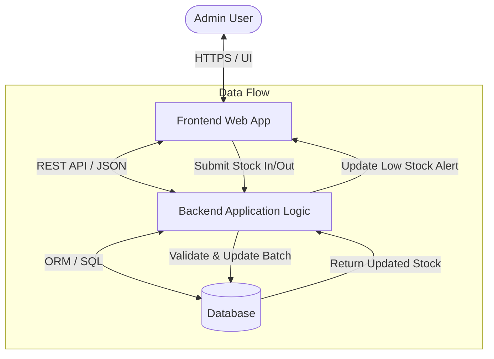
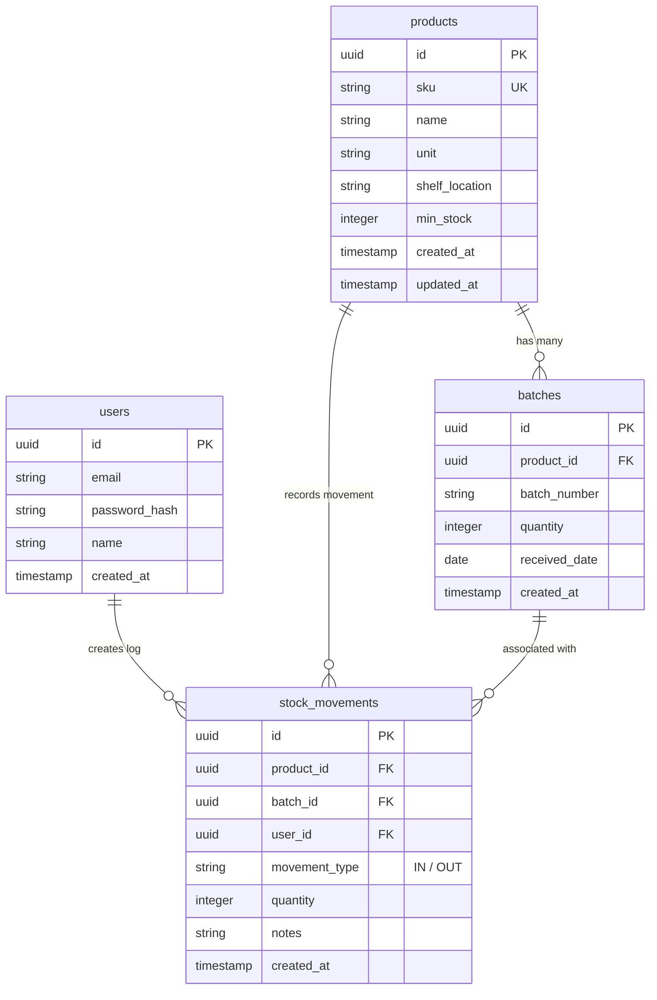

# Panduan Lengkap: Struktur 7-Bagian PRD

> **Dipanggil dari**: `SKILL.md`, Tahap 1.
> **Isi file ini**: Template markdown presisi untuk PRD (Overview, Requirements, Core Features, User Flow, Architecture, Database Schema, Design & Technical Constraints), termasuk contoh Mermaid diagram dan aturan typography.
> **Baca file ini SEBELUM generate PRD** — ikuti struktur & urutan section persis seperti contoh, sesuaikan isi dengan konteks proyek user.

---

## Format & Struktur PRD Wajib

Setiap PRD yang dihasilkan HARUS mengikuti struktur 7 bagian utama ini secara presisi:

```markdown
# PRD — Product Requirements Document: [Nama Produk / Aplikasi]

## 1. Overview
### Latar Belakang & Masalah Utama
[Jelaskan masalah yang ingin diselesaikan, misal: mendigitalkan pencatatan manual, melacak stok real-time, lokasi rak, nomor batch]

### Tujuan Utama Aplikasi
[Deskripsikan visi aplikasi, platform target (Web/Mobile), target pengguna (misal Admin Tunggal), serta hasil yang diharapkan]

---

## 2. Requirements
Tuliskan persyaratan tingkat tinggi (High-Level Requirements) sistem:
- **Aksesibilitas**: [Perangkat & platform akses, misal: Web Browser desktop/laptop]
- **Pengguna**: [Akses & role pengguna, misal: Admin Tunggal dengan akses penuh]
- **Data Input**: [Metode entri data, misal: Input manual diketik vs Scan barcode]
- **Spesifisitas Data**: [Rincian atribut penting per produk, misal: Nomor Batch, Lokasi Rak]
- **Notifikasi**: [Mekanisme notifikasi/alert, misal: Visual Low Stock Alert di Dashboard]

---

## 3. Core Features
Daftar fitur kunci untuk MVP (Minimum Viable Product):

### 1. Dashboard Utama
- Ringkasan total jumlah produk dan nilai aset (opsional).
- Panel Peringatan Stok (Low Stock Alert): Daftar produk di bawah batas minimum.

### 2. Manajemen Produk (Master Data)
- Tambah, Edit, dan Hapus Produk (CRUD).
- Kolom Wajib: Nama Produk, SKU, Satuan, Lokasi Rak, Minimum Stok.

### 3. Pencatatan Stok Masuk (Inbound)
- Form entri penambahan stok.
- Input wajib: Pilih Produk, Jumlah, Nomor Batch, Tanggal Masuk.

### 4. Pencatatan Stok Keluar (Outbound)
- Form pengurangan stok.
- Input wajib: Pilih Produk, Jumlah, Pilih Batch (FIFO/LIFO manual/otomatis), Keterangan.

### 5. Laporan Riwayat (Movement Logs)
- Tabel transaksi riwayat movement log.
- Atribut: Admin (Pengguna), Waktu (Timestamp), Produk, Jumlah (Masuk/Keluar), Batch, Keterangan.

---

## 4. User Flow
Langkah demi langkah alur kerja pengguna (User Workflow):

1. **Login**: Admin masuk menggunakan email dan password.
2. **Monitoring**: Admin mengecek Dashboard untuk memantau status stok & Low Stock Alert.
3. **Setup Produk (Awal)**: Admin menginput data produk baru jika ada item baru (termasuk SKU & Lokasi Rak).
4. **Update Stok**:
   - **Stok Masuk**: Admin membuka menu "Stok Masuk" -> memilih produk -> mengisi jumlah & nomor batch -> menyimpan.
   - **Stok Keluar**: Admin membuka menu "Stok Keluar" -> memilih produk & batch -> mengisi jumlah -> menyimpan.
5. **Verifikasi**: Sistem secara otomatis memperbarui sisa stok total & batch, serta mencatat transaksi di Movement Logs.

---

## 5. Architecture
Gambaran arsitektur sistem dan aliran data teknis secara ringkas:



Deskripsikan komponen:
- **Frontend Layer**: Web Interface responsif (Desktop/Laptop prioritized).
- **Backend Service**: Business logic, validasi stok, manajemen batch, movement logging.
- **Database Layer**: Persistensi data relational (PostgreSQL / MySQL / SQLite).

---

## 6. Database Schema
Struktur Entity Relationship Diagram (ERD) dan deskripsi tabel:



### Ringkasan Tabel Database
| Tabel | Deskripsi |
| :--- | :--- |
| `products` | Master data produk (SKU, satuan, lokasi rak, batas minimum stok). |
| `batches` | Pencatatan per batch masuk per produk dengan nomor batch unik & sisa stok batch. |
| `stock_movements` | Log transaksi pergerakan stok (masuk/keluar), terhubung ke produk, batch, dan admin. |
| `users` | Data akun admin yang memiliki hak akses ke sistem. |

---

## 7. Design & Technical Constraints
Batasan teknis dan panduan desain UI/UX:

### High-Level Technology
- Memakai teknologi modern yang mendukung pengembangan cepat (*rapid development*) dan pemeliharaan mudah (*maintainability*).
- Fleksibel terhadap framework/tech stack (tidak mengikat secara kaku), namun mengutamakan performa, efisiensi, dan skalabilitas untuk skala kecil hingga menengah.

### Typography Rules
Aturan variabel font wajib untuk antarmuka UI:
- **Sans**: `Geist Mono, ui-monospace, monospace`
- **Serif**: `serif`
- **Mono**: `JetBrains Mono, monospace`

### UI & Layout Rules
- **Tampilan**: Dashboard-driven, visual hierarchy yang bersih, kontras tinggi untuk status alert.
- **Ketersediaan Alert**: Visual badge/card berwarna kontras (misal merah/orange) untuk produk yang mencapai/di bawah `min_stock`.

