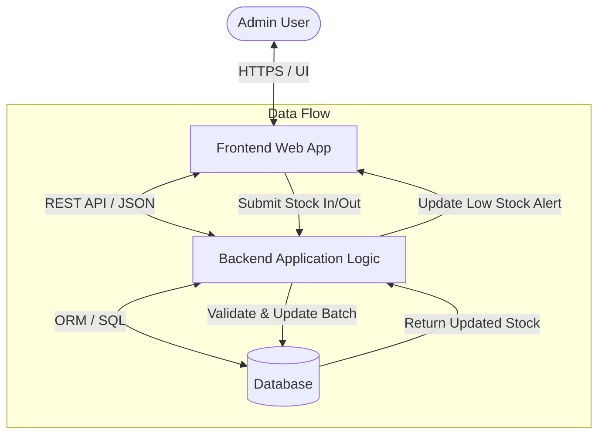
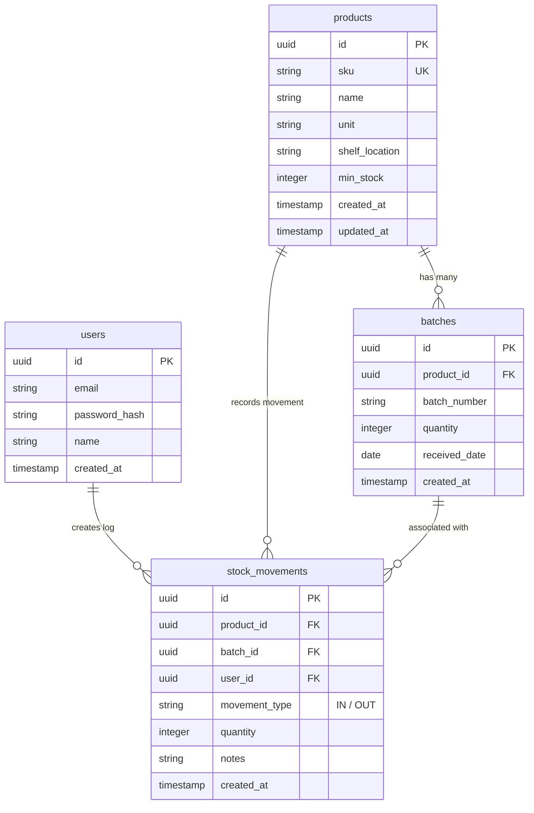
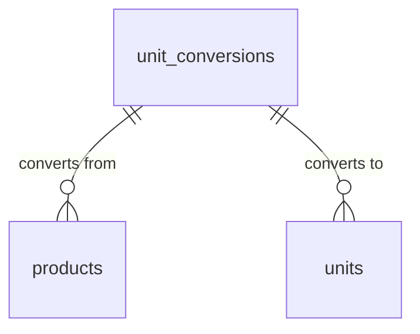
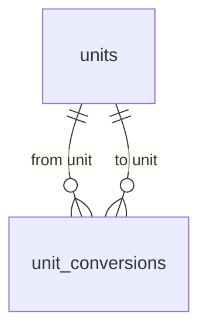
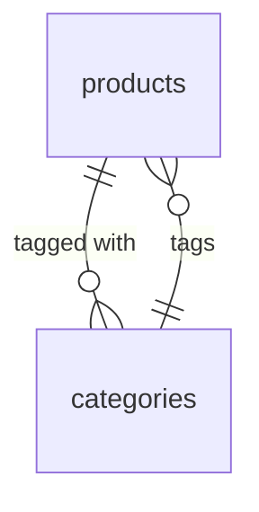
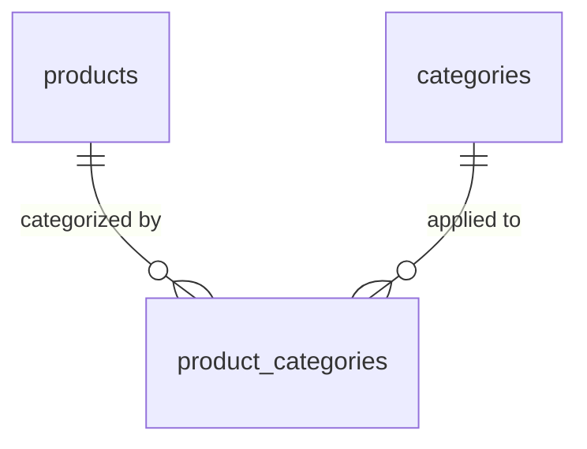
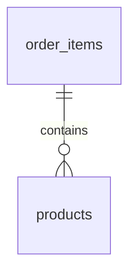

# Complete Guide: 7-Section PRD Structure

> **Called from**: `SKILL.md`, Stage 1.
> **Contents of this file**: Precise markdown template for the PRD (Overview, Requirements, Core Features, User Flow, Architecture, Database Schema, Design & Technical Constraints), including sample Mermaid diagrams and typography rules.
> **Read this file BEFORE generating the PRD** — follow the structure & section order exactly as in the example, adapting the content to the user's project context.

---

## Mandatory PRD Format & Structure

Every PRD produced MUST follow these 7 main sections precisely:

```markdown
# PRD — Product Requirements Document: [Product / App Name]

## 1. Overview
### Background & Core Problem
[Describe the problem to solve, e.g. digitizing manual records, tracking real-time stock, shelf location, batch number]

### Main Product Goals
[Describe the app's vision, target platform (Web/Mobile), target users (e.g. Single Admin), and expected outcomes]

---

## 2. Requirements
List the system's high-level requirements:
- **Accessibility**: [Devices & platform access, e.g. Desktop/Laptop web browser]
- **Users**: [User access & roles, e.g. Single Admin with full access]
- **Data Input**: [Data entry methods, e.g. Manual typed input vs Barcode scan]
- **Data Specifics**: [Important per-product attribute details, e.g. Batch Number, Shelf Location]
- **Notifications**: [Notification/alert mechanism, e.g. Visual Low Stock Alert on Dashboard]

---

## 3. Core Features
List of key features for the MVP (Minimum Viable Product):

### 1. Main Dashboard
- Summary of total product count and asset value (optional).
- Low Stock Alert panel: list of products below the minimum threshold.

### 2. Product Management (Master Data)
- Add, Edit, and Delete Products (CRUD).
- Required fields: Product Name, SKU, Unit, Shelf Location, Minimum Stock.

### 3. Inbound Stock Entry
- Form for adding stock.
- Required inputs: Select Product, Quantity, Batch Number, Received Date.

### 4. Outbound Stock Entry
- Form for reducing stock.
- Required inputs: Select Product, Quantity, Select Batch (manual/auto FIFO/LIFO), Notes.

### 5. Movement Log (History Report)
- Transaction history table.
- Attributes: Admin (User), Timestamp, Product, Quantity (In/Out), Batch, Notes.

---

## 4. User Flow
Step-by-step user workflow:

1. **Login**: Admin signs in with email and password.
2. **Monitoring**: Admin checks the Dashboard to monitor stock status & Low Stock Alerts.
3. **Product Setup (Initial)**: Admin enters new product data when there are new items (including SKU & Shelf Location).
4. **Update Stock**:
   - **Inbound**: Admin opens the "Inbound" menu → selects product → fills in quantity & batch number → saves.
   - **Outbound**: Admin opens the "Outbound" menu → selects product & batch → fills in quantity → saves.
5. **Verification**: The system automatically updates total & batch remaining stock, and records the transaction in Movement Logs.

---

## 5. Architecture
Overview of the system architecture and technical data flow:



Describe the components:
- **Frontend Layer**: Responsive web interface (Desktop/Laptop prioritized).
- **Backend Service**: Business logic, stock validation, batch management, movement logging.
- **Database Layer**: Relational data persistence (PostgreSQL / MySQL / SQLite).

---

## 6. Database Schema
Entity Relationship Diagram (ERD) structure and table descriptions:



### Mermaid erDiagram Syntax Rules (MANDATORY)

The exact format Mermaid accepts for `erDiagram` relationships is:

```
ENTITY1 [CARDINALITY] ENTITY2 : "label"
```

**All three parts on ONE line.** The label goes AFTER both entities, not between them.

#### Cardinality options (must be on the LEFT side of the relationship)

| Symbol | Meaning | Use case |
| :--- | :--- | :--- |
| `||--||` | exactly one to exactly one | User ↔ Profile |
| `||--o{` | exactly one to zero-or-many | Parent → children (most common) |
| `||--|{` | exactly one to one-or-many | Parent → children (at least one) |
| `}o--o{` | zero-or-many to zero-or-many | Tag ↔ Post (model via bridge table) |
| `}|--|{` | one-or-many to one-or-many | Tag ↔ Post (via bridge, mandatory) |

#### Relationship marker (in the middle)

- `--` — identifying relationship (solid line; child cannot exist without parent)
- `..` — non-identifying relationship (dashed line; child can exist independently)

#### Label rules

- Goes AFTER both entities, on the same line.
- Single word / identifier: no quotes needed — `: creates`
- Multiple words or special characters: wrap in double quotes — `: "creates log"`
- **DO NOT** put the label between the two entities. This is the most common parse error (see below).

### Common Mermaid erDiagram Mistakes

#### ❌ Mistake 1 — Label between two entities

This malformed pattern must never appear inside a Mermaid code fence:

`<entity> : "<label>" <entity> ||--...`

It triggers: `Expecting 'UNICODE_TEXT', 'ENTITY_NAME', 'WORD', got 'IDENTIFYING'`. The parser treats the first entity and label as a complete statement, then encounters a second entity followed by a relationship marker.

**Fix** — write one complete relationship per physical line, with the label AFTER both entities:



If a table contains two foreign keys to the same entity, write two complete relationship lines with distinct labels. Never compress them into one line:



#### ❌ Mistake 2 — Many-to-many without a bridge table



Mermaid has no clean way to express many-to-many directly. The convention is to model it via a bridge/junction table.

**Fix** — introduce a bridge table:



#### ❌ Mistake 3 — Entity name with spaces or special characters


Entity names with spaces MUST be quoted, AND the relationship must use the quoted name throughout. Easy to forget in the entity block below, where quoting matters too.

**Fix** — use `snake_case` for entity names (no quoting needed); reserve `PascalCase` for code identifiers only:



#### ❌ Mistake 4 — Using a reserved Mermaid keyword as an entity name

Words like `end`, `direction`, `title` can break the parser. Use specific names like `end_users` or `endpoint_configs`.

#### ❌ Mistake 5 — Defining a relationship but forgetting the entity block

```mermaid
erDiagram
    products ||--o{ product_categories : "categorized by"
    categories ||--o{ product_categories : "applied to"
    -- missing: product_categories { ... } block below
```

The relationship will reference a ghost entity and either render with a warning or fail to draw.

**Fix** — every entity used in a relationship MUST be defined in an entity block below:

```mermaid
erDiagram
    products ||--o{ product_categories : "categorized by"
    categories ||--o{ product_categories : "applied to"

    products { ... }
    categories { ... }
    product_categories { ... }
```

### Self-Check Before Outputting the Mermaid Block

Before saving the PRD, the agent MUST walk through this checklist for EVERY relationship line in the `erDiagram`. Do not treat the malformed example above as copyable Mermaid.

1. ✅ Each line has **exactly 2 entity names** (or 1 + self for self-referential).
2. ✅ Each line has **exactly 1 cardinality** between the two entity names (e.g. `||--o{`).
3. ✅ The label, if any, comes **AFTER both entities**, on the same line — never between them.
4. ✅ Each relationship occupies exactly one physical line; never join two relationships with spaces, tabs, or a line-wrap.
5. ✅ Every entity name used in a relationship is **also defined** in an entity block below (e.g. `products { ... }`).
6. ✅ Entity names are valid identifiers — alphanumeric + underscore, no spaces, no reserved keywords (`end`, `direction`, `title`).
7. ✅ Many-to-many relationships are modeled via a **bridge table**, not directly between the two sides.
8. ✅ Attribute types inside entity blocks are valid Mermaid types: `string`, `integer`, `bigint`, `date`, `datetime`, `timestamp`, `boolean`, `float`, `double`, `json`, `uuid`, etc. — not SQL types like `VARCHAR(255)` or `INT UNSIGNED`.
9. ✅ If two foreign keys point to the same entity, emit two separate valid lines with role-specific labels such as `"from unit"` and `"to unit"`.

### Relationship Line Validation

Before writing the file, inspect the raw Mermaid source between `erDiagram` and its closing fence:

- Every relationship line must match this shape: `ENTITY1 CARDINALITY ENTITY2 : LABEL`.
- A relationship line must contain exactly one cardinality token such as `||--o{`.
- A relationship line must not contain another entity name after the label.
- A line containing `: ...` before a second entity name is invalid and must be rewritten.
- A line containing two cardinality tokens is invalid and must be split.
- Do not place malformed examples inside a `mermaid` code fence; use prose or inline code for anti-patterns.

If any check fails, rewrite the offending line before saving the PRD.

### Database Table Summary
| Table | Description |
| :--- | :--- |
| `products` | Product master data (SKU, unit, shelf location, minimum stock threshold). |
| `batches` | Per-batch inbound record per product with unique batch number & remaining batch stock. |
| `stock_movements` | Stock movement transaction log (in/out), linked to product, batch, and admin. |
| `users` | Admin account data with system access rights. |

---

## 7. Design & Technical Constraints
UI/UX design guidelines and technical constraints:

> ⚠️ **For projects with UI**: fill the Typography Rules & Color Tokens below from the "UI/UX Reference" sub-flow result (see `references/interview-guide.md`) — NOT from the generic example below. If the user provided their own reference, use the tokens extracted from that reference. If the user picked a preset, copy the preset tokens exactly from `references/design-system-presets.md` (hex color, font name, radius — do not paraphrase into vague terms). The example below is purely illustrative of the format, not a default to be used as-is.

### High-Level Technology
- Use modern technology that supports rapid development and easy maintenance.
- Flexible toward the framework/tech stack (not strictly bound), but prioritizes performance, efficiency, and scalability for small to medium scale.

### Typography Rules
Mandatory font variable rules for the UI (filled from the chosen reference/preset):
- **Sans**: `Geist Mono, ui-monospace, monospace`
- **Serif**: `serif`
- **Mono**: `JetBrains Mono, monospace`

### Color Tokens
Filled from the chosen reference/preset — include at minimum Primary, Accent, and semantic colors (Success/Warning/Danger).

### UI & Layout Rules
- **Look & feel**: Dashboard-driven, clean visual hierarchy, high-contrast alert status.
- **Alert availability**: High-contrast colored badge/card (e.g. red/orange) for products that reach or fall below `min_stock`.
```
