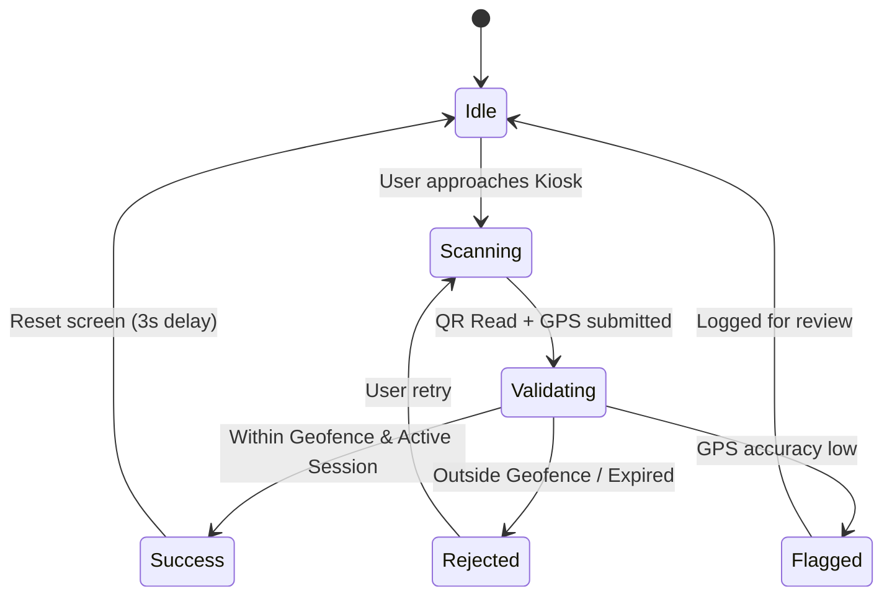
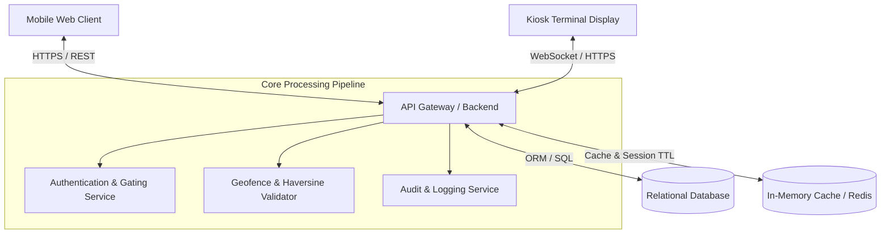
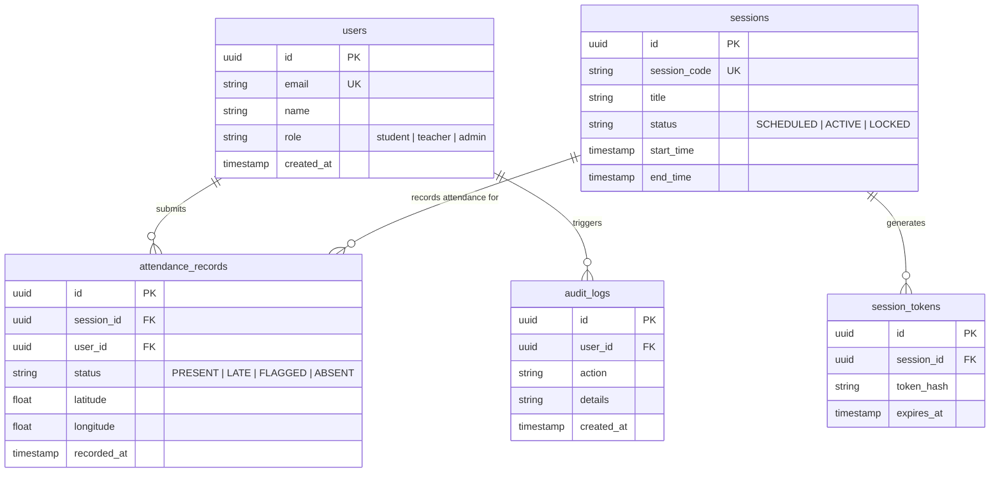
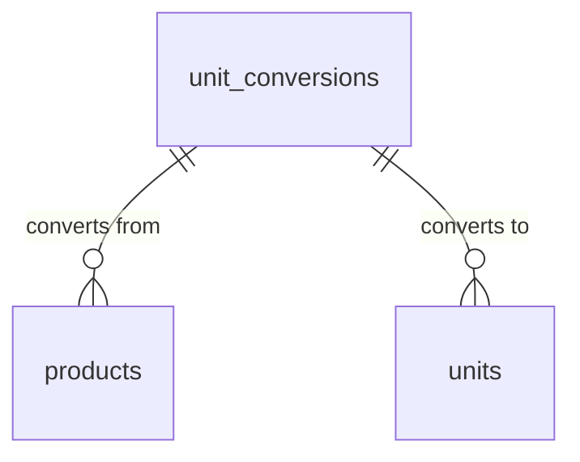
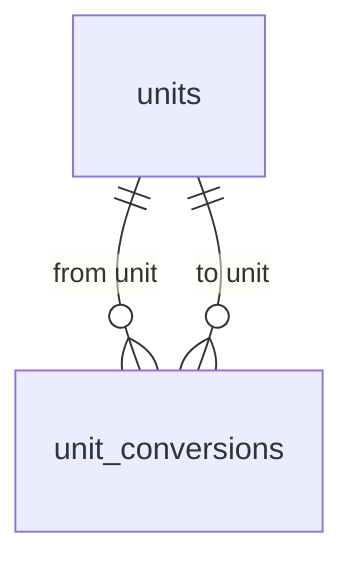
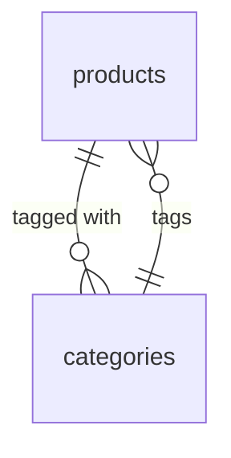
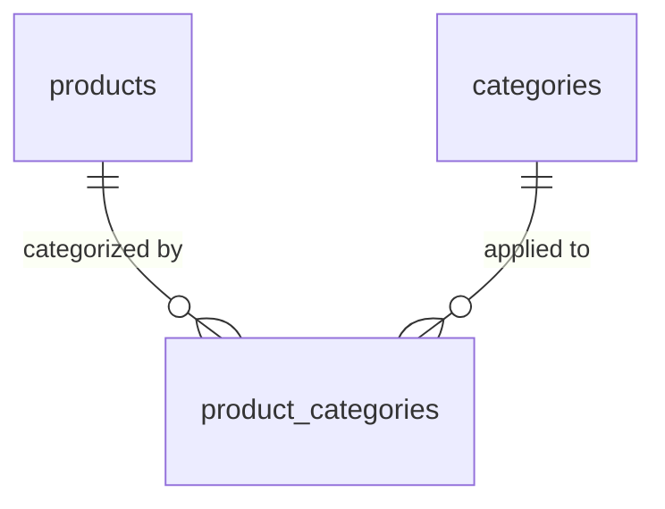
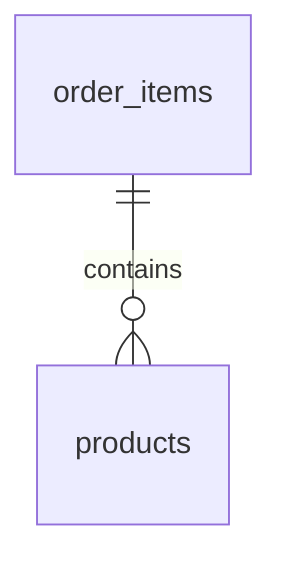
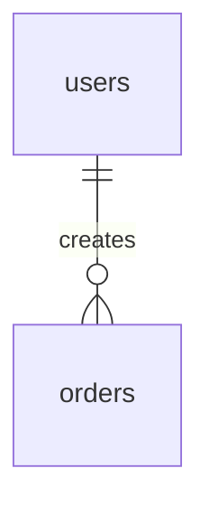
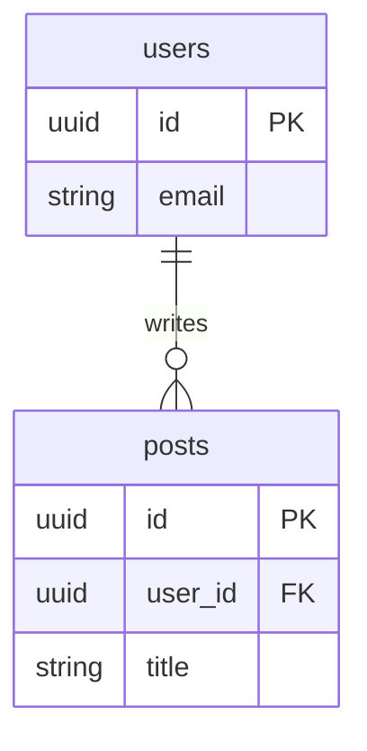

# Complete Guide: 9-Section Product Management PRD Structure

> **Called from**: `SKILL.md`, Stage 1.
> **Contents of this file**: Precise markdown template for the modern 9-Section Product Management PRD (Document Control, Executive Summary & KPIs, Scope & Assumptions, User Personas, Functional Requirements, Edge Cases, NFRs, User Flows, Technical & Architecture Specs Appendix).
> **Read this file BEFORE generating the PRD** — follow the section hierarchy and guidelines strictly, adapting the content to the user's project context.

---

## 🎯 Structural Philosophy: PRD vs. TRD vs. Design Tokens

A professional Product Requirements Document (PRD) balances business clarity, behavioral specifications, and technical actionability without falling into common structural anti-patterns:
1. **No Redundancy**: Requirements and Core Features are consolidated under **User Personas & Roles** (Section 4) and **Functional Requirements** (Section 5) organized by Core Engines / Epics.
2. **WHAT/WHY vs. HOW Separation**: Core functional sections define *behavior*, *acceptance criteria*, and *business rules*. Micro-styling (Tailwind utility classes, hex codes, meta tags) is banned from functional specs and encapsulated within **Non-Functional Requirements** (Section 7) or **Design System Tokens** in the Technical Appendix (Section 9).
3. **Upfront Scope Boundaries**: Non-Goals and Assumptions sit prominently at Section 3 to prevent scope creep from day one.
4. **Objective Accountability**: Section 2 enforces measurable KPIs (success metrics), giving QA and stakeholders clear benchmarks.
5. **Resilience First**: Section 6 explicitly details Edge Cases & Failure Modes (offline states, hardware failures, timeout handling).
6. **Agent & Engineering Actionable**: Architecture (`graph TD`) and Data Model (`erDiagram`) are preserved in Section 9 as a TRD Appendix, providing full technical guidance for coding agents without cluttering product specs.

---

## Mandatory PRD Format & Structure

Every PRD produced MUST follow these 9 main sections precisely:

```markdown
# PRD — Product Requirements Document: [Product / App Name]

## 1. Document Control & Metadata
| Property | Details |
| :--- | :--- |
| **Document Version** | v1.0.0 (or appropriate semver) |
| **Status** | [Draft / In Review / Approved] |
| **Author / Product Owner** | [Author Name / Role] |
| **Technical Lead / Reviewer** | [Reviewer Name / Role] |
| **Last Updated** | [YYYY-MM-DD] |
| **Target Release / Milestone** | [e.g. MVP Release v1.0 / Q3 2026] |

---

## 2. Executive Summary & Problem Statement
### 2.1 Background & Problem Statement
[Describe the core problem, context, and user pain points. Explain WHY this product must exist and what current friction or manual inefficiency it resolves.]

### 2.2 Product Vision & Strategic Objectives
[Describe the high-level vision, target platform (Web/Mobile/Desktop/API), core value proposition, and intended business outcomes.]

### 2.3 Success Metrics & KPIs
Measurable quantitative goals to evaluate product success post-launch:
| Metric / KPI | Baseline (Current) | Target (Post-Launch) | Measurement Method |
| :--- | :--- | :--- | :--- |
| [e.g. Reconciliation Time] | [e.g. ~2 hours / day] | [e.g. < 5 minutes / day] | Audit logs & timestamp tracking |
| [e.g. Attendance Error Rate] | [e.g. ~8% manual errors] | [e.g. < 0.5%] | Discrepancy report logs |
| [e.g. User Adoption Rate] | [e.g. 0%] | [e.g. 95% within Week 2] | Active daily user authentication |

---

## 3. Scope & Assumptions
### 3.1 Core Assumptions
- [List foundational assumptions regarding user environment, connectivity, hardware availability, or user literacy]
- [Example: All kiosk terminals have continuous power and stable Wi-Fi connectivity]
- [Example: Users possess modern smartphones with camera and GPS support]

### 3.2 In-Scope (MVP Capabilities)
- [Explicit capability 1 included in this release]
- [Explicit capability 2 included in this release]
- [Explicit capability 3 included in this release]

### 3.3 Out-of-Scope (Non-Goals)
Explicit exclusions to prevent scope creep:
- [Out-of-Scope 1: e.g. No automated WhatsApp / SMS notifications in MVP]
- [Out-of-Scope 2: e.g. No third-party payroll integration in MVP]
- [Out-of-Scope 3: e.g. No offline biometric hardware synchronization in MVP]

---

## 4. User Personas & Permissions
### 4.1 Target Personas
| Role / Persona | Description & Context | Primary Needs & Goals |
| :--- | :--- | :--- |
| **[e.g. Student / Member]** | [Day-to-day user accessing via mobile web] | [Quick check-in with minimal steps (<10s)] |
| **[e.g. Teacher / Supervisor]** | [Staff managing sessions and verifying attendance] | [Real-time roster visibility and manual override] |
| **[e.g. Admin / Ops]** | [Back-office administrator managing master data] | [Comprehensive audit logs and exportable reports] |

### 4.2 Role-Based Access Control (RBAC) Matrix
| Feature / Module | [Role 1: Student] | [Role 2: Teacher] | [Role 3: Admin] |
| :--- | :---: | :---: | :---: |
| [Scan Kiosk Dynamic QR] | ✅ Execute | ❌ No Access | ❌ No Access |
| [Manual Status Reconciliation] | ❌ No Access | ✅ Edit Class | ✅ Full Edit |
| [Master Data Management] | ❌ No Access | ❌ View Only | ✅ Full CRUD |
| [Export Audit Logs & Reports] | ❌ No Access | ❌ No Access | ✅ Full Export |

---

## 5. Functional Requirements

Organized by Core Capability Engines / Epics:

### 5.1 Engine 1: [e.g. Dynamic QR Kiosk & Session Engine]
- **User Story**: *As a [Role], I want to [action] so that [benefit].*
- **Acceptance Criteria**:
  - [ ] System generates a cryptographically signed dynamic QR refreshed every [N] seconds.
  - [ ] Expired QR codes are rejected immediately with an informative error state.
  - [ ] Terminal runs in persistent fullscreen kiosk mode.
- **Business Logic & Rules**:
  - Gating condition: [Rule description, e.g. Terminal must reject scan if session is locked].
  - Calculation rule: [e.g. Expiry timestamp = `issued_at + 15s`].

### 5.2 Engine 2: [e.g. Geofenced PIN Validation Engine]
- **User Story**: *As a [Role], I want to [action] so that [benefit].*
- **Acceptance Criteria**:
  - [ ] System acquires user coordinate and calculates distance to designated kiosk location.
  - [ ] Rejects check-in if distance exceeds [e.g. 50 meters].
- **Business Logic & Rules**:
  - Haversine distance algorithm evaluated server-side to prevent client spoofing.
  - Failed attempt rate-limiting: maximum 3 failed attempts per 5 minutes.

### 5.3 Engine 3: [e.g. Reconciliation & Attendance Lock Workflow]
- **User Story**: *As a [Role], I want to [action] so that [benefit].*
- **Acceptance Criteria**:
  - [ ] Teacher reviews real-time roster and locks session attendance.
  - [ ] Locking prevents further check-in submissions.
- **Business Logic & Rules**:
  - Session state machine: `SCHEDULED` → `ACTIVE` → `RECONCILING` → `LOCKED`.
  - Once `LOCKED`, only Admin role can perform adjustments with an audit reason required.

### 5.4 Engine 4: [e.g. Reporting & Audit Panel]
- **User Story**: *As an Admin, I want to view and export reports so that audit compliance is maintained.*
- **Acceptance Criteria**:
  - [ ] Filterable records by date range, role, status, and department.
  - [ ] CSV / Excel export completed within < 3 seconds for 10,000 records.

---

## 6. Edge Cases & Exception Handling
| Failure Mode / Edge Case | Trigger Condition | System Behavior & Fallback | User Feedback & Recovery |
| :--- | :--- | :--- | :--- |
| **Network Disruption during Check-in** | Client loses connection during submission | Queue transaction in local client state or retry with exponential backoff (max 3 tries) | Display inline toast: *"Connection lost. Retrying..."* with a manual retry button |
| **GPS Drift / Low Accuracy** | Geolocation accuracy > 100m radius reported by device | Mark submission as `FLAGGED_PENDING_REVIEW` instead of outright silent drop | Prompt user: *"Location accuracy is low. Please move closer to an open window or retry."* |
| **QR Scan Collision / Race Condition** | Two devices submit identical QR token simultaneously | First received payload succeeds; subsequent payload rejected with `TOKEN_ALREADY_CONSUMED` | Second user sees: *"QR Code has already been consumed. Please scan the newly refreshed code."* |
| **Kiosk Hardware / Camera Crash** | Display device reboots or browser freezes | Auto-relaunch service worker / fallback PIN displayed statically | On-screen prompt instructing user to use emergency manual PIN entry |

---

## 7. Non-Functional Requirements (NFR)
### 7.1 Usability & Accessibility
- **Responsive Layout**: Mobile-first design for handheld devices; wide dashboard layout for Admin/Kiosk displays (minimum supported width: 360px).
- **Accessibility**: High contrast ratios compliant with WCAG 2.1 AA; touch targets ≥ 44x44px.
- **Keyboard Navigation**: All forms navigable via `Tab`, `Enter`, and `Escape`.

### 7.2 Performance & Latency
- **Time to Interactive (TTI)**: < 1.5 seconds on 4G mobile connections.
- **API Response Budget**: 95th percentile response time < 300ms for check-in validation; < 100ms for QR refresh.
- **Concurrent Load**: System must handle [e.g. 500] concurrent check-ins within a 5-minute peak window without degradation.

### 7.3 Security & Data Integrity
- **Session Security**: Session tokens expire after [e.g. 15 minutes of inactivity]; refresh tokens rotated securely.
- **Anti-Spoofing & Integrity**: Coordinates and device fingerprints hashed; client time drift checked against server NTP.
- **Data Protection**: Sensitive personally identifiable information (PII) encrypted at rest and in transit via TLS 1.3.

### 7.4 Reliability & Observability
- **System Availability**: 99.5% uptime target during operational hours (06:00 - 18:00 local time).
- **Audit Logging**: All write operations and state transitions logged with user ID, IP address, user agent, and timestamp.

---

## 8. User Flows & Visual Diagrams
### 8.1 End-to-End User Flow (ASCII Diagram)
```text
+----------------+      +------------------+      +-------------------+
| Student/User   |      | Kiosk Terminal   |      | Backend Server    |
+----------------+      +------------------+      +-------------------+
        |                         |                         |
        |                         |-- 1. Request Dynamic QR>|
        |                         |<- 2. Sign & Return QR --|
        |                         |                         |
        |                         |                         |
        |-- 3. Scan QR Code ----->|                         |
        |-- 4. Submit PIN + GPS --------------------------->|
        |                         |                         |-- 5. Validate Geofence
        |                         |                         |-- 6. Check Token TTL
        |                         |                         |-- 7. Record Attendance
        |<- 8. Return Success / Failure Confirmation -------|
        |                         |                         |
```

### 8.2 Operational State Transitions


---

## 9. Technical & Architecture Specs (Appendix / TRD Bridge)

### 9.1 System Architecture Diagram


### 9.2 Data Model & Entity Relationship Diagram (ERD)



### Mermaid erDiagram Syntax Rules (MANDATORY)

The exact format Mermaid accepts for `erDiagram` relationships is:

```
ENTITY1 [CARDINALITY] ENTITY2 : "label"
```

**All three parts on ONE line.** The label goes AFTER both entities, not between them.

#### Cardinality options (must be on the LEFT side of the relationship)

| Symbol | Meaning | Use case |
| :--- | :--- | :--- |
| `||--||` | exactly one to exactly one | User ↔ Profile |
| `||--o{` | exactly one to zero-or-many | Parent → children (most common) |
| `||--|{` | exactly one to one-or-many | Parent → children (at least one) |
| `}o--o{` | zero-or-many to zero-or-many | Tag ↔ Post (model via bridge table) |
| `}|--|{` | one-or-many to one-or-many | Tag ↔ Post (via bridge, mandatory) |

#### Relationship marker (in the middle)

- `--` — identifying relationship (solid line; child cannot exist without parent)
- `..` — non-identifying relationship (dashed line; child can exist independently)

#### Label rules

- Goes AFTER both entities, on the same line.
- Single word / identifier: no quotes needed — `: creates`
- Multiple words or special characters: wrap in double quotes — `: "creates log"`
- **DO NOT** put the label between the two entities. This is the most common parse error (see below).

### Common Mermaid erDiagram Mistakes

#### ❌ Mistake 1 — Label between two entities

This malformed pattern must never appear inside a Mermaid code fence:

`<entity> : "<label>" <entity> ||--...`

It triggers: `Expecting 'UNICODE_TEXT', 'ENTITY_NAME', 'WORD', got 'IDENTIFYING'`. The parser treats the first entity and label as a complete statement, then encounters a second entity followed by a relationship marker.

**Fix** — write one complete relationship per physical line, with the label AFTER both entities:



If a table contains two foreign keys to the same entity, write two complete relationship lines with distinct labels. Never compress them into one line:



#### ❌ Mistake 2 — Many-to-many without a bridge table



Mermaid has no clean way to express many-to-many directly. The convention is to model it via a bridge/junction table.

**Fix** — introduce a bridge table:



#### ❌ Mistake 3 — Entity name with spaces or special characters


Entity names with spaces MUST be quoted, AND the relationship must use the quoted name throughout. Easy to forget in the entity block below, where quoting matters too.

**Fix** — use `snake_case` for entity names (no quoting needed); reserve `PascalCase` for code identifiers only:



#### ❌ Mistake 4 — Using a reserved Mermaid keyword as an entity name

Words like `end`, `direction`, `title` can break the parser. Use specific names like `end_users` or `endpoint_configs`.

#### ❌ Mistake 5 — Defining a relationship but forgetting the entity block

```mermaid
erDiagram
    products ||--o{ product_categories : "categorized by"
    categories ||--o{ product_categories : "applied to"
    -- missing: product_categories { ... } block below
```

The relationship will reference a ghost entity and either render with a warning or fail to draw.

**Fix** — every entity used in a relationship MUST be defined in an entity block below:

```mermaid
erDiagram
    products ||--o{ product_categories : "categorized by"
    categories ||--o{ product_categories : "applied to"

    products { ... }
    categories { ... }
    product_categories { ... }
```

### Self-Check Before Outputting the Mermaid Block

Before saving the PRD, the agent MUST walk through this checklist for EVERY relationship line in the `erDiagram`. Do not treat the malformed example above as copyable Mermaid.

1. ✅ Each line has **exactly 2 entity names** (or 1 + self for self-referential).
2. ✅ Each line has **exactly 1 cardinality** between the two entity names (e.g. `||--o{`).
3. ✅ The label, if any, comes **AFTER both entities**, on the same line — never between them.
4. ✅ Each relationship occupies exactly one physical line; never join two relationships with spaces, tabs, or a line-wrap.
5. ✅ Every entity name used in a relationship is **also defined** in an entity block below (e.g. `products { ... }`).
6. ✅ Entity names are valid identifiers — alphanumeric + underscore, no spaces, no reserved keywords (`end`, `direction`, `title`).
7. ✅ Many-to-many relationships are modeled via a **bridge table**, not directly between the two sides.
8. ✅ Attribute types inside entity blocks are valid Mermaid types: `string`, `integer`, `bigint`, `date`, `datetime`, `timestamp`, `boolean`, `float`, `double`, `json`, `uuid`, etc. — not SQL types like `VARCHAR(255)` or `INT UNSIGNED`.
9. ✅ If two foreign keys point to the same entity, emit two separate valid lines with role-specific labels such as `"from unit"` and `"to unit"`.

### Relationship Line Validation

Before writing the file, inspect the raw Mermaid source between `erDiagram` and its closing fence:

- Every relationship line must match this shape: `ENTITY1 CARDINALITY ENTITY2 : LABEL`.
- A relationship line must contain exactly one cardinality token such as `||--o{`.
- A relationship line must not contain another entity name after the label.
- A line containing `: ...` before a second entity name is invalid and must be rewritten.
- A line containing two cardinality tokens is invalid and must be split.
- Do not place malformed examples inside a `mermaid` code fence; use prose or inline code for anti-patterns.

If any check fails, rewrite the offending line before saving the PRD.

### Database Table Summary
| Table | Description |
| :--- | :--- |
| `users` | User accounts, credentials, and RBAC role assignment. |
| `sessions` | Class / meeting operational sessions with scheduled timings and lifecycle states. |
| `attendance_records` | Individual check-in submissions with coordinates, status, and verification stamps. |
| `session_tokens` | Ephemeral signed tokens generated for kiosk dynamic QR rotations. |
| `audit_logs` | Immutable audit trail of administrative modifications and security overrides. |

### 9.3 Recommended Technology Stack
- **Frontend Layer**: [e.g. Next.js / Vite React / Tailwind CSS]
- **Backend & Logic Layer**: [e.g. Node.js / Laravel / Go / Python FastApi]
- **Database Layer**: [e.g. PostgreSQL / Supabase / MySQL]
- **State & Cache**: [e.g. Redis / In-Memory Cache for ephemeral QR validation]

### 9.4 Design System Tokens (UI Projects)
Tokens derived from chosen design reference or preset (e.g. Modern Minimalist / Dark Tech):
- **Typography Tokens**:
  - Heading Font: `Inter, sans-serif`
  - Body Font: `Inter, sans-serif`
  - Monospace / Token Font: `JetBrains Mono, monospace`
- **Color Palette Tokens**:
  - Primary: `#2563EB` (Blue 600)
  - Secondary / Neutral: `#0F172A` (Slate 900)
  - Surface / Background: `#F8FAFC` (Slate 50)
  - Success: `#16A34A` (Green 600)
  - Warning: `#D97706` (Amber 600)
  - Danger / Error: `#DC2626` (Red 600)
- **Component Geometry Tokens**:
  - Corner Radius: `rounded-lg` (8px)
  - Touch Target Size: minimum 44px height
```

---

## 📐 Mermaid erDiagram Syntax Rules (MANDATORY)

The exact format Mermaid accepts for `erDiagram` relationships is:

```
ENTITY1 [CARDINALITY] ENTITY2 : "label"
```

**All three parts on ONE line.** The label goes AFTER both entities, not between them.

### Cardinality options (must be on the LEFT side of the relationship)

| Symbol | Meaning | Use case |
| :--- | :--- | :--- |
| `||--||` | exactly one to exactly one | User ↔ Profile |
| `||--o{` | exactly one to zero-or-many | Parent → children (most common) |
| `||--|{` | exactly one to one-or-many | Parent → children (at least one) |
| `}o--o{` | zero-or-many to zero-or-many | Tag ↔ Post (model via bridge table) |
| `}|--|{` | one-or-many to one-or-many | Tag ↔ Post (via bridge, mandatory) |

### Relationship marker (in the middle)

- `--` — identifying relationship (solid line; child cannot exist without parent)
- `..` — non-identifying relationship (dashed line; child can exist independently)

### Label rules

- Goes AFTER both entities, on the same line.
- Single word / identifier: no quotes needed — `: creates`
- Multiple words or special characters: wrap in double quotes — `: "creates log"`
- **DO NOT** put the label between the two entities.

---

## Common Mermaid erDiagram Mistakes

### ❌ Mistake 1 — Label between two entities
```text
-- INVALID
users : "creates" orders ||--o{ ...
```
Triggers: `Expecting 'UNICODE_TEXT', 'ENTITY_NAME', 'WORD', got 'IDENTIFYING'`.

**Fix** — write one complete relationship per physical line:


### ❌ Mistake 2 — Many-to-many without a bridge table
Mermaid has no clean way to express many-to-many directly. Always introduce a junction/bridge table:


### ❌ Mistake 3 — Entity name with spaces or special characters
Use `snake_case` for entity names (no quoting needed):


### ❌ Mistake 4 — Using a reserved Mermaid keyword as an entity name
Words like `end`, `direction`, `title` can break the parser. Use specific names like `end_users` or `report_titles`.

### ❌ Mistake 5 — Defining a relationship but forgetting the entity block
Every entity name in a relationship MUST have a corresponding entity block below:


---

## Self-Check Before Outputting the Mermaid Block

Before saving the PRD, walk through this checklist for EVERY relationship line in the `erDiagram`:
1. ✅ Each line has **exactly 2 entity names**.
2. ✅ Each line has **exactly 1 cardinality** between the two entity names (e.g. `||--o{`).
3. ✅ The label, if any, comes **AFTER both entities**, on the same line.
4. ✅ Each relationship occupies exactly one physical line.
5. ✅ Every entity name used in a relationship is **defined in an entity block below**.
6. ✅ Entity names are valid identifiers — alphanumeric + underscore, no spaces, no reserved keywords.
7. ✅ Many-to-many relationships are modeled via a **bridge table**.
8. ✅ Attribute types inside entity blocks are valid Mermaid types: `string`, `integer`, `bigint`, `date`, `datetime`, `timestamp`, `boolean`, `float`, `uuid`, etc. — not SQL types like `VARCHAR(255)`.
9. ✅ If two foreign keys point to the same entity, emit two separate valid lines with role-specific labels (e.g. `"from unit"` and `"to unit"`).
